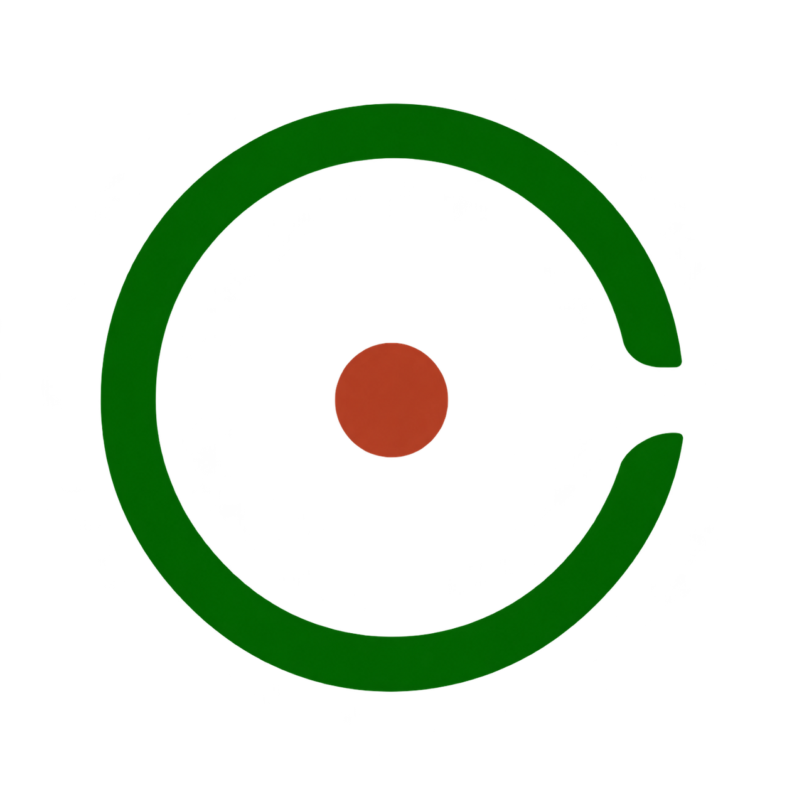

<p align="center">
  
</p>

# Retinal Review Workbench

A clinician-controlled workspace for retinal image review and research dataset preparation. Reviewers confirm image context, make the final diabetic retinopathy (DR) grade decision, and confirm annotations. AI suggestions can assist, but the clinician remains responsible for the final result.

This project supports public or approved synthetic research and clinical-support workflows. It is **not** an autonomous diagnostic or regulated medical device.

## Start with your role

| Role | First step | Detailed guide |
| --- | --- | --- |
| Clinician or reviewer | Start the workstation, open a workspace, and select a Worklist image. | [Clinician user manual](docs/manuals/clinician/index.qmd) |
| Workstation operator | Install and start the Windows review workstation. | [Installation](docs/operations/INSTALLATION.md) and [troubleshooting](docs/operations/TROUBLESHOOTING.md) |
| Model API operator | Set up the separate Linux GPU service when AI assistance is needed. | [Model API operations](docs/operations/MODEL_SERVER.md) |
| Developer | Set up a development environment and run the checks below. | [Developer technical guide](docs/manuals/developer/index.qmd) and [design system](DESIGN.md) |

## 1. Install the Windows review workstation

**Requirements:** Windows 10 or 11, Git, and approved internet access for the initial setup. The supported setup does not require machine-wide Administrator access or a workstation GPU. Model serving is a separate optional deployment.

Open PowerShell in a folder where the repository should live:

```powershell
git clone https://github.com/siriponsri/dr-support-screening-poc.git
Set-Location dr-support-screening-poc
.\SETUP.cmd
```

`SETUP.cmd` provisions the project Python and Node.js tooling as needed, installs locked dependencies, and builds the browser app. Wait for it to complete before starting the workstation. For a development installation with test and DICOM dependencies, use `.\SETUP.cmd --dev` instead. See [Installation](docs/operations/INSTALLATION.md) for diagnostics and manual recovery.

## 2. Start and open a workspace

```powershell
.\START.cmd
```

The browser opens at **http://127.0.0.1:8000/app/**. In **Settings**, create a **New workspace** with a name, local input folder, output folder, and SQLite database path. Select that workspace before reviewing images. Keep the review database and output folder in approved local storage; source images are not moved by workspace setup.

On later days, use `.\OPEN_APP.cmd` to reopen or start the app. When finished, run `.\STOP.cmd` to stop the process managed by this checkout. The launcher keeps the workstation on `127.0.0.1:8000` and stores logs under ignored `local-state/`. [Configuration](docs/operations/CONFIGURATION.md) covers private settings and deployment choices.

## 3. Review an image

1. In **Worklist**, select **Confirm Image**. Check the pseudonymous patient key, eye, and reviewer; confirm the image context.
2. In **Review**, inspect the source image and any available model evidence. Open **Clinician Review**.
3. Select the final DR grade and choose **Confirm DR Grade**. The human decision is authoritative, whether or not an AI suggestion exists.
4. In **Annotation Editor**, inspect the suggested regions of interest (ROIs). Correct or remove an AI ROI if needed, or add a human annotation. Untouched AI ROIs remain AI suggestions.
5. Choose **Confirm Annotation** to finish the case. Individual AI ROIs do not need separate confirmation to complete the case.
6. Continue to the next incomplete Worklist image. If its image context was already confirmed, it opens in Review; otherwise, confirm its image context first.

The supported image inputs are JPEG, PNG, TIFF, and supported single-frame ophthalmic fundus DICOM. Consult the [image selection guide](docs/clinician/IMAGE_SELECTION_GUIDE.html) before admitting data. AI scores are model evidence, not calibrated clinical probabilities. The [clinician manual](docs/manuals/clinician/index.qmd) explains the controls, editing, and repeated review in detail.

## 4. Check readiness and export

Open **Datasets** to check **DR-ready** and **Lesion-ready** separately. DR readiness depends on a confirmed final grade; lesion readiness depends on a current confirmed annotation set. Review the status before exporting. The export includes a manifest and task-specific data files; [dataset manifest reference](docs/reference/DATASET_MANIFEST.md) defines their fields and grouping rules. Original admitted images remain immutable.

## 5. Connect the optional Model API

The Windows workstation can be used for human review without a local GPU or local model weights. AI assistance uses a **separate, controlled Linux NVIDIA GPU host**. On that host, from a clean checkout at the chosen deployment path, the operator runs:

```bash
cd /opt/dr-support-screening-poc
./scripts/model-server/setup.sh
./scripts/model-server/start.sh
```

Run setup once with approved network access. While the server is running, open a second terminal on the GPU host and check its health:

```bash
cd /opt/dr-support-screening-poc
./scripts/model-server/healthcheck.sh
```

Verify a `PASS` status and `assets_verified: true` before use. Configure `REMOTE_MODEL_URL` and, if required, `REMOTE_MODEL_TOKEN` in a private workstation `.env` or approved environment, then restart the workstation. Follow the [Model API guide](docs/operations/MODEL_SERVER.md) for verified assets, host/network controls, and failure recovery. Do not place model weights or credentials in Git.

## 6. Run checks before sharing changes

After `.\SETUP.cmd --dev`, run the following from the repository root in PowerShell:

```powershell
.\.venv\Scripts\python.exe -m pytest -q
.\.venv\Scripts\python.exe -m ruff check dr_support tests
Set-Location frontend
npm.cmd test
npm.cmd run typecheck
npm.cmd run build
Set-Location ..
npm.cmd test
.\.venv\Scripts\python.exe scripts\docs\check_docs.py
```

The frontend commands cover browser code and type checks; the root `npm.cmd test` runs release smoke tests. Report any skipped checks when sharing a change. See the [developer guide](docs/manuals/developer/index.qmd) for component ownership and test details.

## Where to find things

| Path | Purpose |
| --- | --- |
| `frontend/` | Review workstation interface and frontend tests |
| `dr_support/` | Python application, review state, export, and Model API integration |
| `tests/` | Backend and release smoke coverage |
| `scripts/model-server/` | Linux GPU Model API setup and launch |
| `docs/` | Clinician, operator, developer, and dataset guides |
| `DESIGN.md` | Accepted visual and interaction rules |

The [documentation portal](docs/README.md) lists the canonical guides. Use approved public or synthetic examples in tests and documentation. Never commit protected health information, secrets, credentials, model weights, runtime databases, or `local-state/` contents. See [LICENSE](LICENSE) and [third-party notices](THIRD_PARTY_NOTICES.md).
