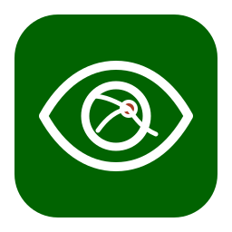
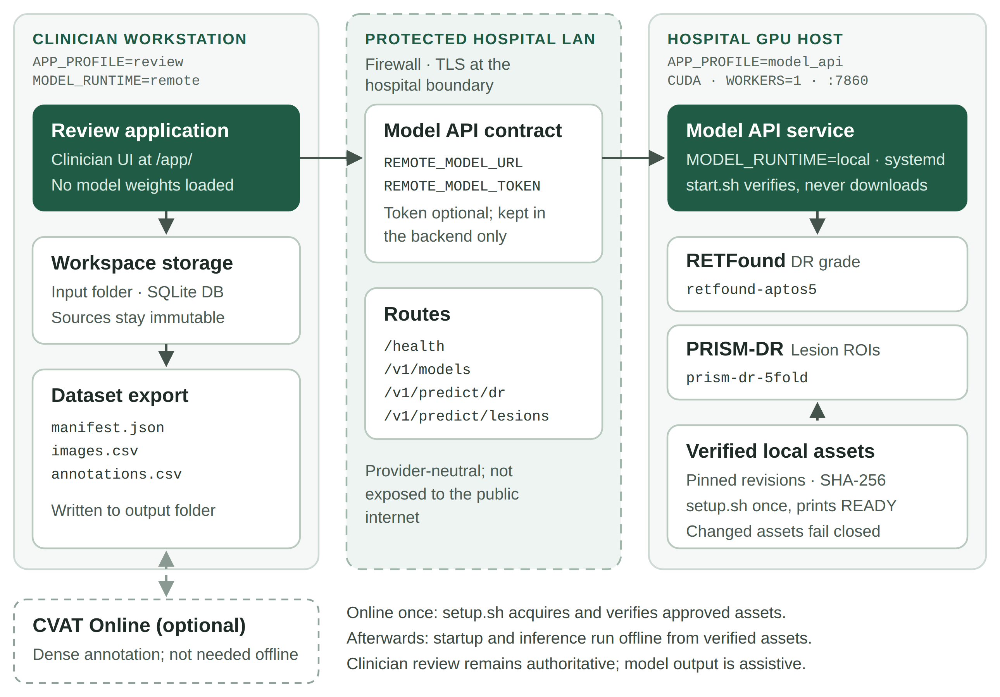
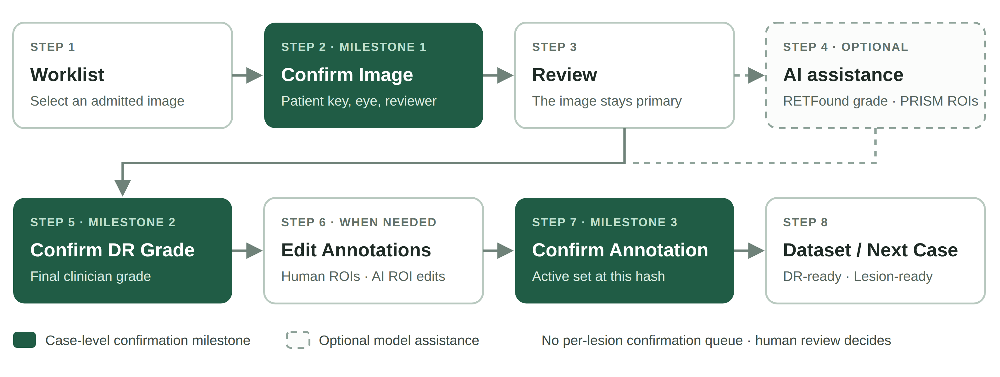

# Retinal Review Workbench

Software version: **0.7.0**

<p align="center"></p>

Retinal Review Workbench is a clinician-controlled retinal screening review and dataset workspace. It admits retinal images, resolves patient and eye context, keeps the original source and derived analysis traceable, and supports optional model evidence before human review and export.

It is a public/synthetic research and clinical-support proof of concept. It is not autonomous diagnosis, referral, or a regulated medical device.



## Clinician workflow

1. Start or select a local Workspace with an input folder, output folder, and SQLite review database.
2. Scan the input folder. The Worklist reports image readiness, patient/eye context, review status, and unsupported inputs in plain language.
3. Open an eligible image in Review. The original image stays primary; zoom, pan, and full-screen inspection remain available.
4. Run model assistance when needed. RETFound provides a DR grade suggestion; PRISM-DR provides optional lesion overlays. Overlay labels show class and score such as `HE - 0.90`.
5. Toggle or filter overlays. Review is read-only inspection; optional AI ROI correction or removal is available from **Edit Annotations**. No per-lesion confirmation is required before clinician review can be completed.
6. Open **Clinician Review** to confirm the final DR grade. Use **Edit Annotations** only when a human annotation or an optional AI ROI correction/removal is needed, then confirm the active annotation set when appropriate. Advanced geometry work may use CVAT.
7. Inspect Models & Audit for read-only model, inference, hash, and annotation provenance, then review the separate DR-ready and Lesion-ready states in Datasets before export.



The legacy `/ui/` surface remains mounted for compatibility with existing local integrations. Normal users should open `/app/`.

## Architecture

The review workstation runs the `review` profile and never loads model weights. It calls the provider-neutral Model API over the configured hospital network. The GPU host runs `model_api` with `MODEL_RUNTIME=local`, verified local assets, and one worker by default. CVAT Online is optional and is not required for offline review or export.

| Component | Role |
| --- | --- |
| Review application | React/Vite clinician UI served by FastAPI at `/app/`; local SQLite review state and workspace catalog. |
| RETFound | Five-class DR grade suggestion through `retfound-aptos5`; score output is uncalibrated model evidence. |
| PRISM-DR | Lesion ROI suggestions through `prism-dr-5fold`; raw detections remain distinct from bounded display/pre-label evidence. |
| Model API | FastAPI endpoints `/health`, `/v1/models`, `/v1/predict/dr`, and `/v1/predict/lesions`. |
| Dataset export | Provenance-preserving `manifest.json`, `images.csv`, and `annotations.csv` written to the configured output folder. |

## Supported input intent

The supported retinal input intent is JPEG, PNG, TIFF, and standards-conformant single-frame ophthalmic photography DICOM handled by the DICOM extras. Ophthalmic DICOM remains on the existing display and provenance path. MRI, OCT, PACS objects, non-fundus DICOM, unsupported SOP classes, multi-frame objects, and untested transfer syntaxes are not added to model support. A recognized non-fundus DICOM is reported as `Unsupported modality`; a codec, decode, or multi-frame problem keeps its specific technical status.

RETFound and PRISM-DR accept fundus CFP inputs only. Empty PRISM detections do not prove that no lesion is present. Human review remains authoritative.

## Review workstation quick start

Prerequisites: Python 3.11 or 3.12, Node.js/npm, and (for DICOM) the optional DICOM dependencies.

```powershell
git clone https://github.com/siriponsri/dr-support-screening-poc.git
cd dr-support-screening-poc
py -3.12 -m venv .venv
.venv\Scripts\python.exe -m pip install -e ".[test,dicom]"
npm ci
cd frontend
npm ci
npm run build
cd ..
START.cmd
```

Open `http://127.0.0.1:8000/app/`. `START.cmd` sets `APP_PROFILE=review` and `MODEL_RUNTIME=remote`; configure `REMOTE_MODEL_URL` and, when required, `REMOTE_MODEL_TOKEN` in the private process environment before starting. The workstation remains usable for admission, review state, and export while the Model API is unavailable, but inference is disabled until the connection is healthy.

## Hospital Model API

Use a Linux GPU host for the supported long-running deployment. The one-time setup is online because it installs dependencies, clones the pinned upstream sources, downloads the approved checkpoint assets, verifies hashes, and runs synthetic smoke inference:

```bash
git clone https://github.com/siriponsri/dr-support-screening-poc.git /opt/dr-support-screening-poc
cd /opt/dr-support-screening-poc
./scripts/model-server/setup.sh
```

`setup.sh` ends with `READY` only after RETFound and PRISM-DR assets pass revision/checkpoint verification and the smoke checks. The pinned source revisions and hashes are declared in `dr_support/providers/retfound.py`, `dr_support/providers/prism.py`, and `dr_support/providers/prism_assets.json`.

Normal startup is read-only and does not download assets:

```bash
cd /opt/dr-support-screening-poc
./scripts/model-server/start.sh
# in another shell
./scripts/model-server/healthcheck.sh
```

The start script verifies all local assets, requires CUDA by default, sets `WORKERS=1`, and starts on `0.0.0.0:7860`. Missing or modified assets fail closed. After setup, normal startup and inference do not require internet access. For systemd, use `sudo ./scripts/model-server/install-service.sh`, then `sudo systemctl start dr-support-model-api`.

## Deployment topology

The review workstation and Model API should be on a protected hospital LAN. Do not expose the Model API directly to the public internet. Put TLS/authentication and firewall policy at the hospital boundary; the optional bearer token is supplied through environment/secrets management and is never committed.

The included service unit uses `/opt/dr-support-screening-poc`, user `drsupport`, `/etc/dr-support/model-server.env`, and port `7860`. The review workstation uses local workspace storage and connects to that service with `REMOTE_MODEL_URL`.

## Offline-after-setup behavior

Once setup succeeds, the Model API uses only the verified local source checkouts and checkpoint files. Startup invokes `python -m dr_support.setup_models --model all --verify`; it never calls a download path. Offline acceptance covers `/health`, `/v1/models`, and local inference. CVAT Online is intentionally optional and excluded from the offline requirement.

## Documentation

- [Installation](docs/INSTALLATION.md) - clean-clone workstation and server setup.
- [Deployment](docs/DEPLOYMENT.md) - topology, service lifecycle, and connectivity.
- [Model Server](docs/MODEL_SERVER.md) - assets, verification, startup, and health checks.
- [Operator Runbook](docs/OPERATOR_RUNBOOK.md) - routine operations and escalation.
- [Configuration](docs/CONFIGURATION.md) - environment variables and safe defaults.
- [Security and Privacy](docs/SECURITY_PRIVACY.md) - data, secrets, and safety boundaries.
- [Backup and Restore](docs/BACKUP_RESTORE.md) - state, exports, and recovery.
- [Troubleshooting](docs/TROUBLESHOOTING.md) - actionable failure checks.
- Clinicians: [Clinician User Manual PDF](docs/CLINICIAN_USER_MANUAL.pdf), [Quarto source](docs/manual/index.qmd), and [manual build](scripts/manual/build_manual.py). The HTML site is generated at `dist/manual/site/`.
- Hospital IT/operators: [Deployment and Operations Manual PDF](docs/DEPLOYMENT_OPERATIONS_MANUAL.pdf), [Quarto source](docs/operator-manual/index.qmd), and [operator build](scripts/operator_manual/build_manual.py). The HTML site is generated at `dist/manual/operator-site/`.
- [Clinician workflow](docs/USER_WORKFLOW.md), [feature reference](docs/FEATURE_REFERENCE.md), and [dataset manifest](docs/DATASET_MANIFEST.md).
- [Owner demonstration](docs/demo/RETINAL_REVIEW_DEMO.html) - self-contained, offline, presenter-controlled product story (arrow keys / Space step through reveals; Home / End jump). Edit [the source](docs/demo/src/RETINAL_REVIEW_DEMO.source.html) and rebuild with `python scripts/docs/build_demo.py`.
- [CVAT Online setup](docs/CVAT_ONLINE_SETUP.md) - optional dense annotation only.
- [Future Experiments](docs/FUTURE_EXPERIMENTS.md) - explicitly deferred work.
- [Release Checklist](docs/RELEASE_CHECKLIST.md) - maintainer acceptance checks.

To rebuild either manual, install released Quarto and a XeLaTeX distribution, then run
`.venv\Scripts\python.exe scripts/manual/build_manual.py` or
`.venv\Scripts\python.exe scripts/operator_manual/build_manual.py` from the repository root.
Set `QUARTO_BIN` when Quarto is not on `PATH`. Each Quarto Book source produces its matching HTML site and PDF.
To refresh the manual screenshots, start `python scripts/manual/capture_server.py` (synthetic data only) and run `python scripts/manual/capture_manual.py`.

## Validation

```powershell
.venv\Scripts\python.exe -m pytest -q
.venv\Scripts\python.exe -m ruff check dr_support tests
cd frontend
npm test
npm run typecheck
npm run build
cd ..
npm test
```

## Privacy and safety

Use only synthetic/public fixtures in tests, screenshots, and examples. Do not commit PHI, secrets, CVAT credentials, model weights, runtime databases, or local-state artifacts. Original admitted images remain immutable; exported manifests use the existing pseudonymous and provenance-aware contracts. Do not treat model scores as calibrated clinical probabilities, and do not interpret an empty model result as absence of disease.

## License

See [LICENSE](LICENSE) and [THIRD_PARTY_NOTICES.md](THIRD_PARTY_NOTICES.md) for project and third-party terms. RETFound and PRISM-DR remain subject to their upstream research/non-commercial and dependency licenses; hospital deployment must obtain its own legal clearance.
