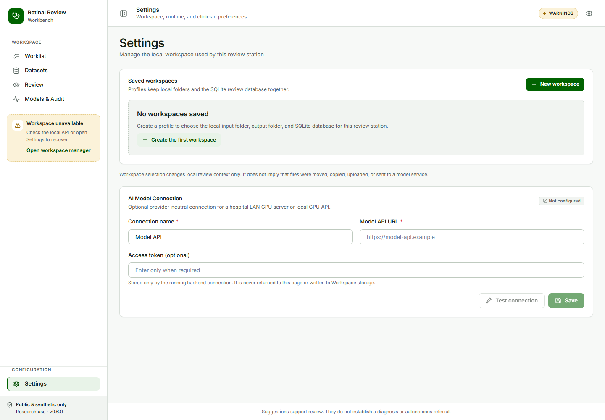
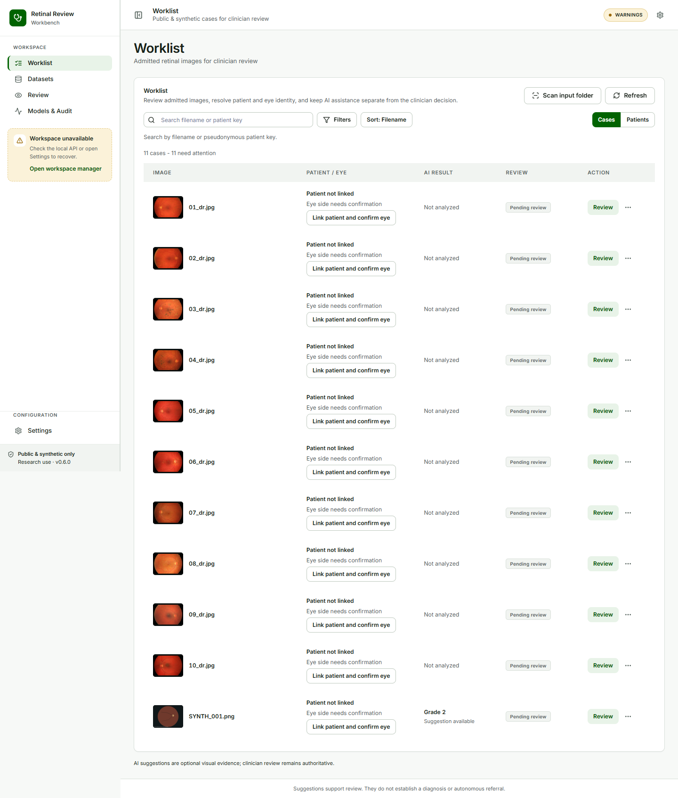
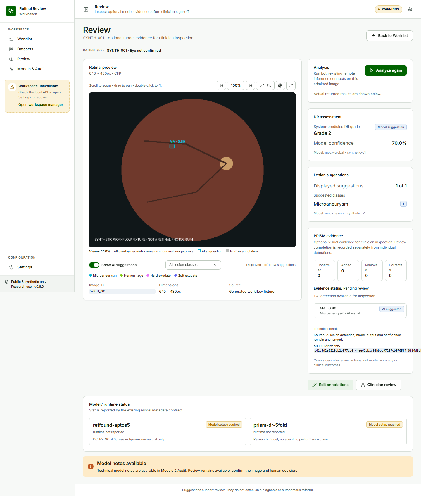
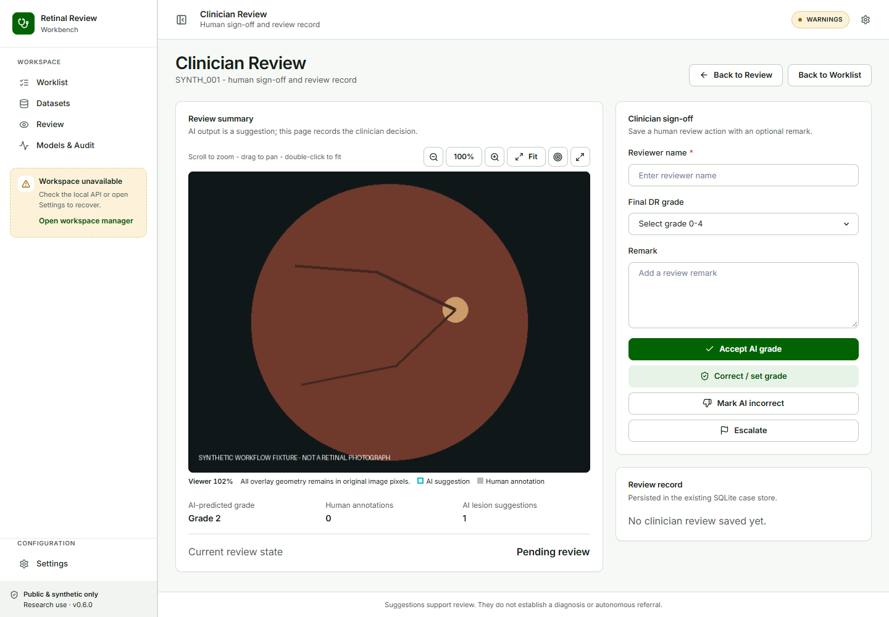
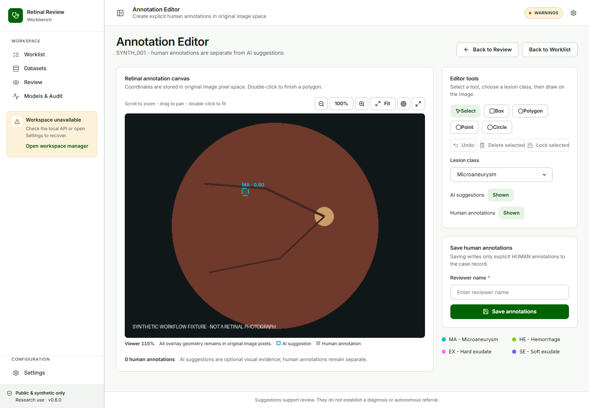
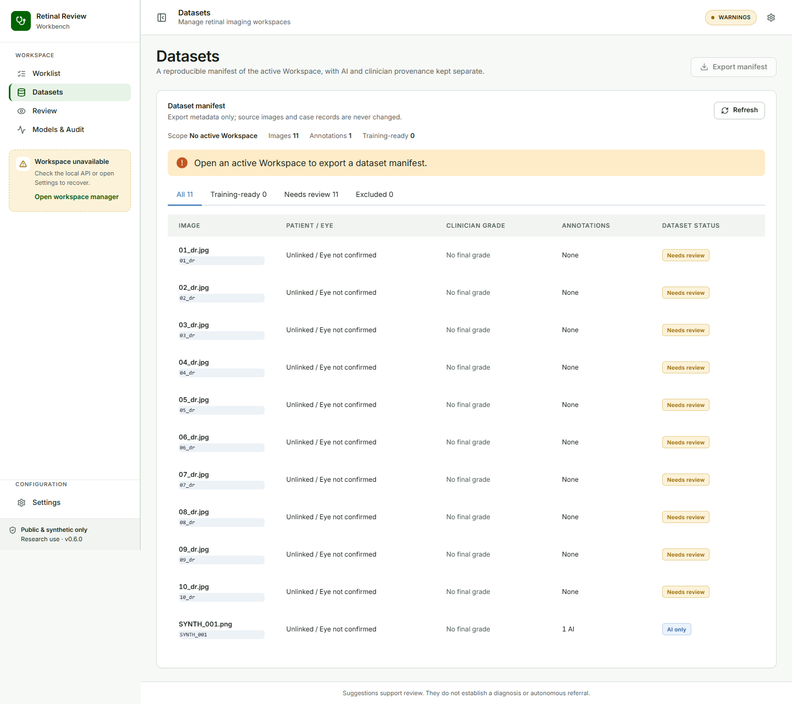
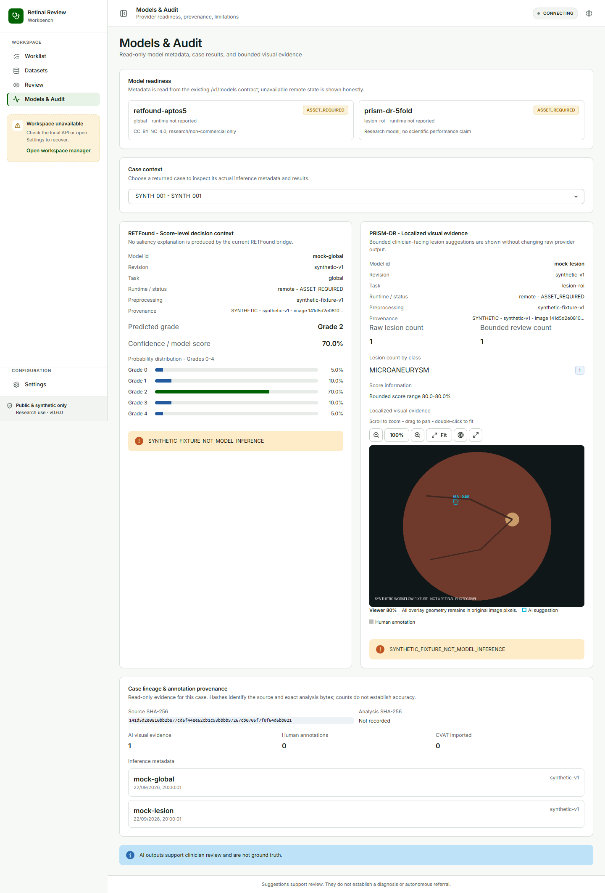

# Retinal Review Workbench - Clinician User Manual

This manual describes the final clinician interface. Screenshots are generated from the built application with public/synthetic data by `scripts/manual/capture_manual.py`.

## 1. Open the application

Open the review workstation at `http://127.0.0.1:8000/app/` after the operator starts `START.cmd`.

## 2. Select a Workspace

Use Settings to create or select a Workspace. A Workspace defines the input folder, output folder, and SQLite review database. The application does not delete source images when a saved profile is removed.

## 3. Scan the input folder

Choose **Scan input folder** from Worklist. JPEG, PNG, TIFF, and supported ophthalmic DICOM can be admitted for review. MRI, OCT, PACS objects, and other non-fundus DICOM appear as **Unsupported modality**; they are not sent to the retinal models.

## 4. Resolve patient and eye context

Use the Worklist identity action to confirm or set the pseudonymous patient key and laterality. Patient identity and eye laterality are independent fields. Leave a case unlinked when evidence is insufficient.

## 5. Open Review

Open an eligible case from Worklist. The retinal image remains the primary surface. Use Fit, 100%, zoom, pan, full-screen, and the original-pixel coordinate inspector as needed.

## 6. Use optional model evidence

Select **Analyze** when model assistance is needed. RETFound provides a DR grade suggestion. PRISM-DR provides optional lesion ROI overlays. Toggle **Show AI suggestions** and use the lesion-class filter to reduce visual density. Each overlay displays its class and model score, for example `HE - 0.90`.

AI ROIs are evidence, not unresolved tasks. You may select an ROI to inspect it, edit or remove it when a recorded correction is needed, or leave it unchanged. You do not need to confirm or reject every detection before saving the clinician review.

## 7. Record clinician review

Open **Clinician review**, enter the reviewer name, and save an accepted, corrected, incorrect, or escalated decision. The final human review is authoritative and is independent of individual PRISM ROI actions.

## 8. Use dense annotation only when needed

Open **Edit annotations** for geometry-level work. Human annotations are separate from AI evidence and remain in original-image coordinates. CVAT Online is optional; use it only when a dense correction workflow is actually required.

## 9. Inspect Dataset and Models & Audit

Datasets shows the active Workspace, eligibility, annotation status, and export action. Models & Audit is read-only: it shows model IDs and revisions, inference metadata, detection counts by class, source and analysis SHA-256 values, and annotation provenance.

## Safety note

Model output supports clinician review. A confidence value is a model detection score, not a calibrated probability. An empty PRISM result does not prove absence of lesions. This software is not autonomous diagnosis or referral software.
