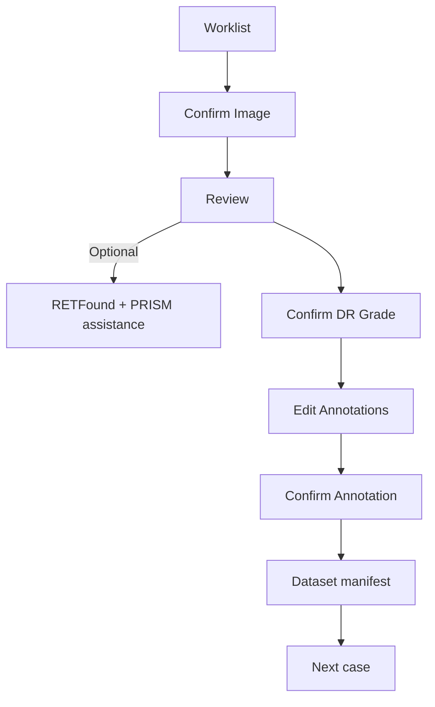

# Clinician workflow

Retinal Review Workbench is a clinician-controlled workstation for reviewing admitted retinal images and preparing provenance-preserving research exports. The normal path has three explicit confirmation milestones. Model output is optional assistance; the clinician's decision remains authoritative.

## Roles

- **Clinician/reviewer** confirms image context, records the DR grade, and confirms the active annotation set when required.
- **Dataset operator** selects the Workspace, checks task-specific readiness, and exports the manifest.
- **Hospital operator** starts the review workstation and the separate Model API. The operator does not replace clinician review.
- **Maintainer** verifies model provenance, application behavior, and release documentation.

## Normal path

1. Open **Worklist** and select an admitted image.
2. Use **Confirm Image** to check the image status, pseudonymous patient key, eye, and reviewer attribution. This is one context milestone; it does not infer identity from a filename.
3. Open **Review**. The retinal image is the primary surface. Run **Analyze** only when model assistance is useful and available.
4. Inspect the optional RETFound grade suggestion and PRISM lesion overlays. Toggle **Show AI suggestions** or filter lesion classes. No detection-by-detection confirmation is required.
5. Open **Clinician Review**, select the final DR grade, and choose **Confirm DR Grade**. Keeping the model grade records `AI_ACCEPTED`; changing it records `AI_CORRECTED`; a grade without model output records `MANUAL`.
6. Open **Edit annotations** when human annotations, AI ROI class correction/removal, or geometry work is needed. **Save draft** and **Save & Next** are non-final draft operations.
7. Select **Confirm Annotation** when the current active annotation set has been reviewed. This records a reviewer, timestamp, and deterministic annotation-set hash. It does not claim that an empty set proves absence of lesions.
8. Use **Datasets** to inspect **DR-ready** and **Lesion-ready** status, then export the package when the Workspace is ready.

## Exception paths

- **Not retinal, inadequate, unsupported, or excluded:** follow the explicit Worklist status and exception action. MRI and other non-fundus DICOM are reported as **Unsupported modality** and are not sent to retinal models.
- **Model service unavailable:** continue local admission, human review, annotation, and export where possible. Do not describe a remote model outage as an image decoder failure.
- **Escalate:** use **Escalate** from Clinician Review when the case needs a separate decision or cannot be safely completed.
- **CVAT:** use the optional CVAT round trip for dense annotation or geometry correction. Local review remains the source of the final case state.

## Drafts, navigation, and hints

- **Save draft** persists human annotations without confirming them or making a case training-ready.
- **Save & Next** performs the same draft save and then opens the next case. Navigation never silently confirms a clinical milestone.
- **Previous** and **Next** use the available case order. The annotation editor guards against leaving while changes are unsaved, saving, or failed.
- A quiet **Next action** hint is guidance only. Close it to disable hints on the workstation; re-enable hints in **Settings**.
- **Use as default reviewer on this workstation** stores only a browser-local convenience value. It is not authentication and never rewrites historical attribution.

## Authority and evidence

RETFound supplies a grade suggestion and PRISM-DR supplies lesion suggestions. Displayed model scores are model evidence, not calibrated clinical probabilities. An empty PRISM result does not prove that lesions are absent. Corrections and removals preserve the original AI evidence and add human-authored state; they do not turn AI output into ground truth automatically.

## Dataset outcome

The v2 export keeps classification and lesion readiness separate. DR-grade readiness requires a valid final clinician grade and its provenance. Lesion readiness requires a current case-level annotation confirmation whose hash still matches the active set. One task can be ready while the other is not.
