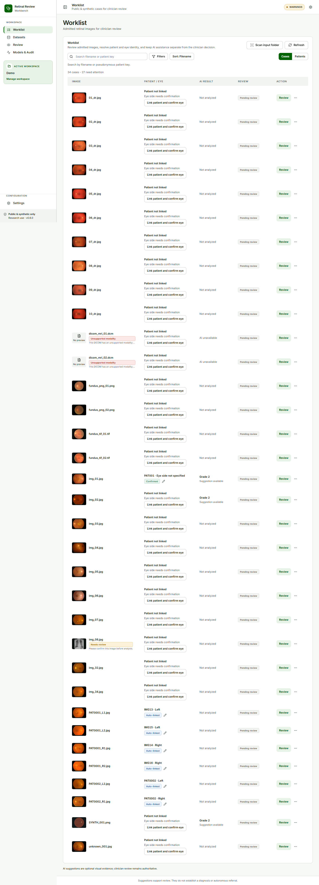

## Worklist and case setup {#sec-worklist}

### Start the workstation

#### Goal

Open the clinician UI and establish the local Workspace used for the review session.

#### Before you start

The operator must have completed the workstation installation and built the frontend. If model assistance is required, the operator must configure the hospital Model API connection privately.

#### Steps

1. Start `START.cmd`, or start the documented review profile manually.
2. Open `http://127.0.0.1:8000/app/`.
3. Open **Settings** and create or select a Workspace.
4. Confirm the input folder, output folder, and SQLite review database shown for the Workspace.
5. Return to **Worklist** and select **Scan input folder**.

#### Expected result

Admitted files appear with plain-language status. Original source files remain immutable.

#### What the system records

The Workspace catalog stores profile paths and case state. Admission stores source identity, dimensions, modality decision, quality state, and source hash.

{#fig-worklist fig-cap="Worklist shows admitted cases, context, status, and available actions."}

### Confirm Image

#### Goal

Confirm the image context needed before downstream analysis and review.

#### Before you start

Open a case with **Confirm Image** available. Treat any filename or resolver suggestion as evidence only.

#### Steps

1. Select **Confirm Image** in the Worklist action cell.
2. Review the image name and image status.
3. Enter or clear the **Pseudonymous patient key**. Leave it empty when the case should remain unlinked.
4. Set **Eye** to **Left**, **Right**, or **Unknown**.
5. Enter **Reviewer name**, or use the workstation default if appropriate.
6. Optionally select **Use as default reviewer on this workstation**.
7. Select **Confirm Image**.

#### Expected result

The case context and image review timestamp are saved as one milestone. A supported fundus image can proceed to **Review**.

#### What the system records

The system records patient/eye resolution, image admission review, reviewer, timestamp, and the `CONFIRM_IMAGE` audit event. It does not infer authenticated identity.

::: {.callout-important title="IMPORTANT — shared workstations"}
The default reviewer is a browser-local convenience. Change or clear it when the workstation user changes. Previously recorded reviewer names are not rewritten.
:::

{#fig-confirm-image fig-cap="Confirm Image combines context review and reviewer attribution."}

### Worklist exceptions

Use the visible exception action when a case is not suitable for routine review. An MRI or other non-fundus DICOM must remain **Unsupported modality**. Do not send it to RETFound or PRISM-DR.
