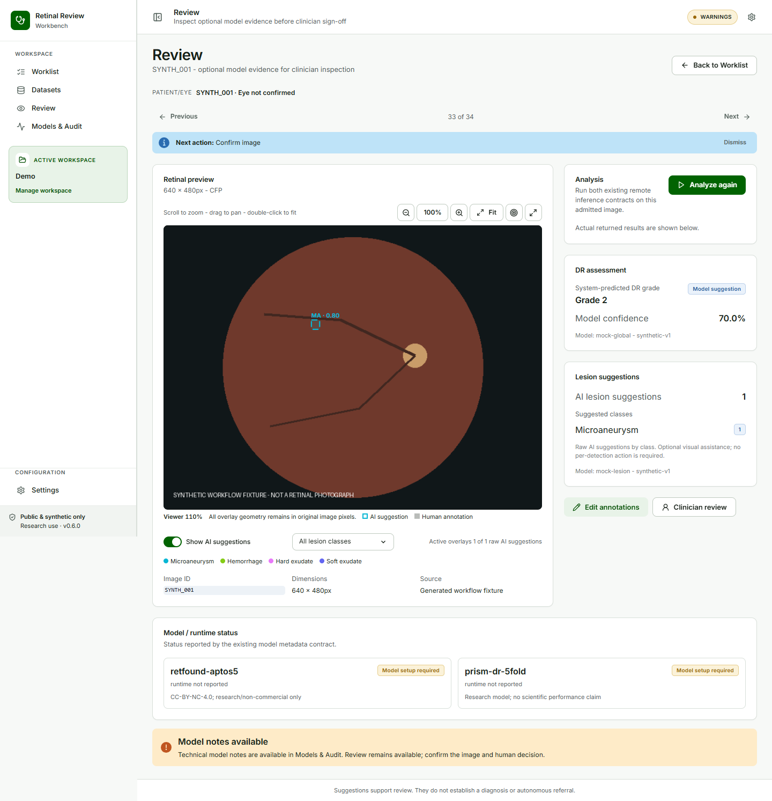

## Review workspace {#sec-review}

### Review the retinal image

#### Goal

Inspect the original retinal image and decide whether optional model evidence is useful.

#### Before you start

The case must be admitted as a supported retinal input. Resolve or confirm the context as required by the Worklist state.

#### Steps

1. Open the case and select **Review**.
2. Use the image viewer controls for fit, zoom, pan, full-screen inspection, or coordinate inspection as needed.
3. Read the patient/eye context shown above the image.
4. If model assistance is needed and available, select **Analyze**.
5. Use **Show AI suggestions** to show or hide PRISM overlays.
6. Use the lesion filter to show **All lesion classes**, **MA · Microaneurysm**, **HE · Hemorrhage**, **EX · Hard exudate**, or **SE · Soft exudate**.

#### Expected result

The image remains the largest and primary review surface. The right side shows a compact DR assessment, lesion suggestion counts, and model/runtime status. An untouched ROI may display a class and score such as `HE · 0.90`.

#### What the system records

Analysis records the existing model outputs, model identifiers, inference metadata, source hash, and analysis lineage. Toggling or filtering overlays does not alter the model result.

{#fig-review fig-cap="Review keeps the retinal image primary and exposes optional model assistance."}

::: {.callout-note title="NOTE — no evidence queue"}
PRISM detections are optional visual assistance. Review completion does not depend on confirming, rejecting, or reducing an unresolved detection count to zero.
:::

### RETFound suggestion

RETFound provides a five-class DR grade suggestion and model score. It is not automatically confirmed. Use **Clinician Review** to select the final grade.

### PRISM overlays

PRISM-DR provides bounded visual lesion suggestions. The compact summary describes raw AI suggestions by lesion class; it is not a count of clinician-reviewed annotations. A human correction is shown without reassigning the original AI score to the new class.

### Models & Audit

Open **Models & Audit** for read-only model IDs, revisions, runtime status, inference events, detection counts, source/analysis SHA-256 values, and annotation provenance. This page is for inspection and audit, not another clinical task list.
