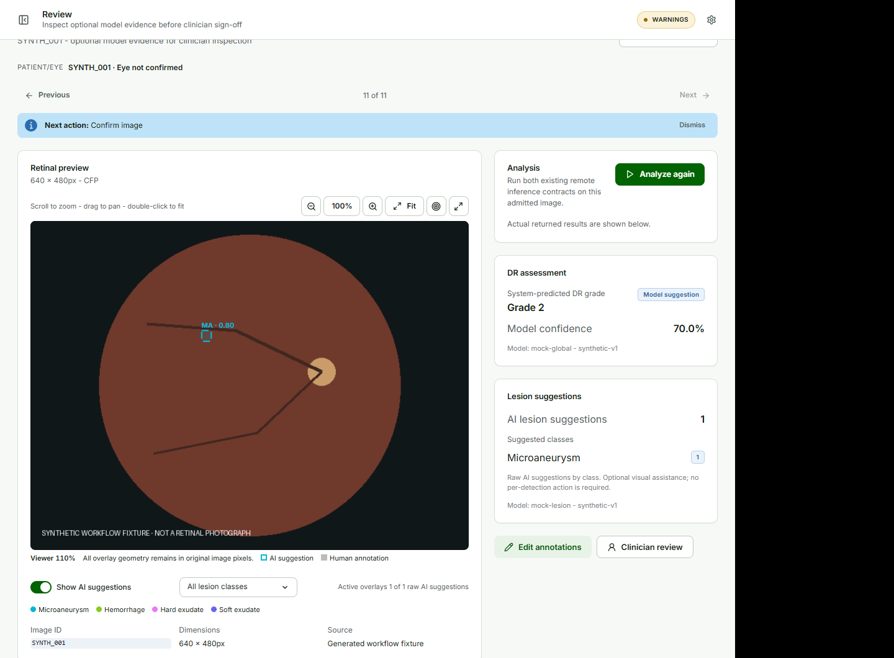
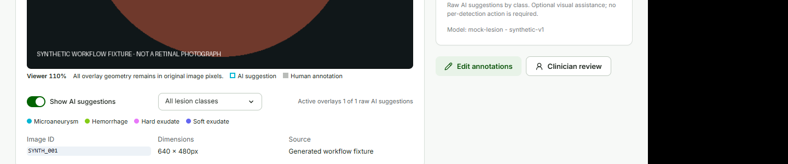

# Review {#sec-review}

## Inspect the image

**Purpose.** Inspect the original retinal image and decide whether optional model evidence is useful.

**Before you begin.** Confirm the image from **Worklist**. The case must be a supported retinal input.

**Procedure.**

1. Open the case in **Review**.
2. Use the viewer controls to fit, zoom, pan, inspect coordinates, or open a larger view.
3. Read the patient and eye context above the image.
4. Choose **Analyze** when model assistance is needed and the Model API is ready.
5. Use **Show AI suggestions** to show or hide PRISM overlays.
6. Use **Filter lesion overlays** to choose **All lesion classes**, **MA - Microaneurysm**, **HE - Hemorrhage**, **EX - Hard exudate**, or **SE - Soft exudate**.

**Expected result.** The retinal image remains the primary review surface. The right side presents a compact DR assessment, lesion suggestion summary, and model/runtime status.

{#fig-review fig-cap="Review keeps the retinal image primary and places optional model assistance beside it."}

## Read model suggestions

RETFound presents a suggested DR grade and model score. PRISM-DR presents raw lesion suggestions by class. Untouched overlays may show a class and score such as `HE - 0.90`.

The lesion summary describes AI suggestions. It is not a queue of unresolved clinician tasks. Review completion does not depend on confirming, rejecting, or reducing an AI detection count to zero.

{#fig-ai-controls fig-cap="Use the Show AI suggestions toggle and lesion filter to control optional visual overlays."}

## Models & Audit

Open **Models & Audit** when technical inspection is needed. This read-only page can show model IDs and revisions, runtime state, inference metadata, source and analysis hashes, detection counts, and annotation provenance. It is an audit surface, not another review queue.

::: {.callout-note title="NOTE - score meaning"}
If a clinician changes an AI lesion class in **Edit Annotations**, the original AI score remains attached to the original class. The corrected human class must not be displayed with that score.
:::
