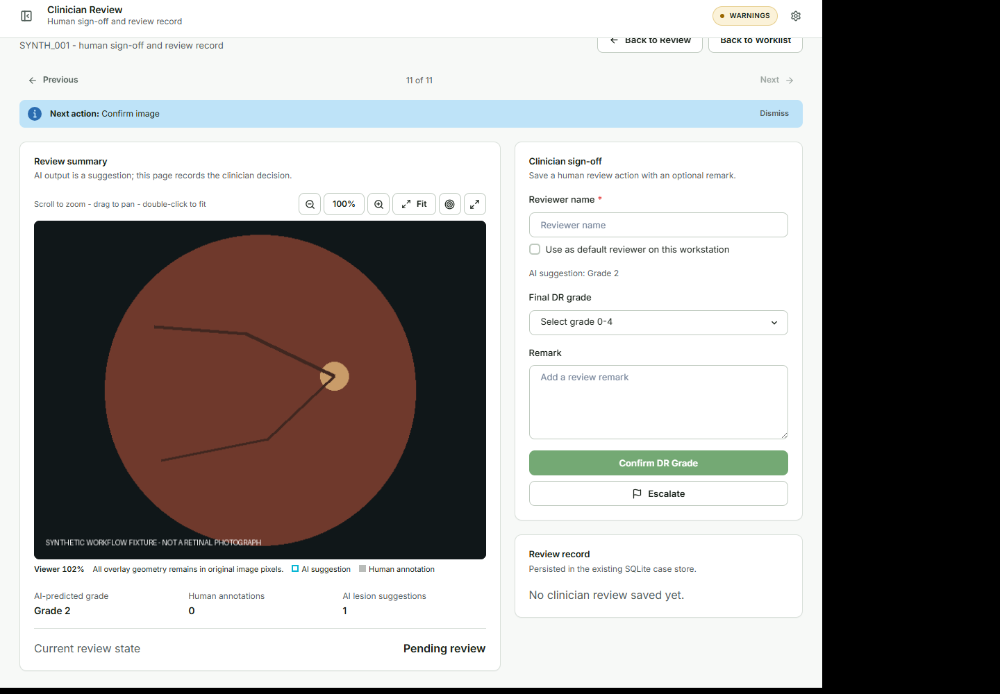
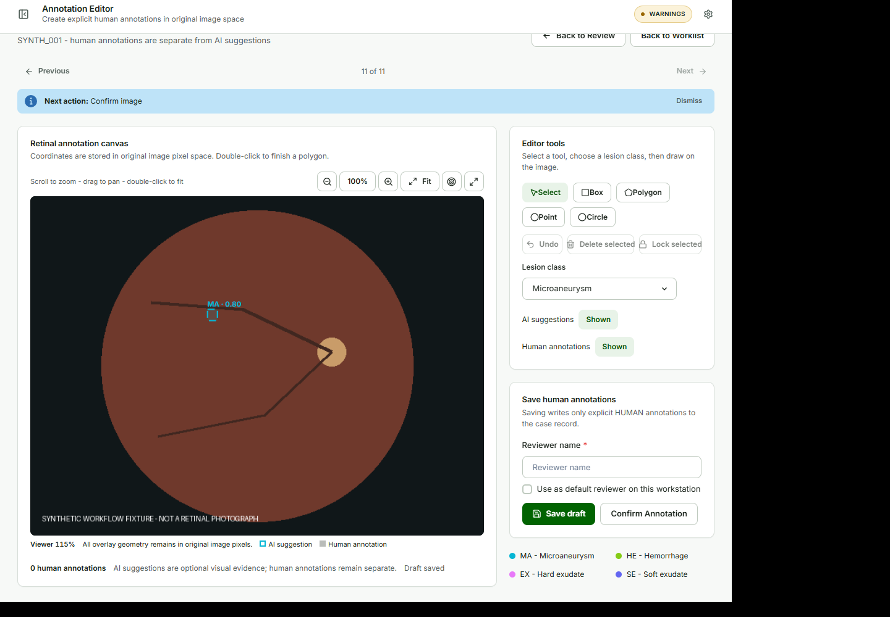
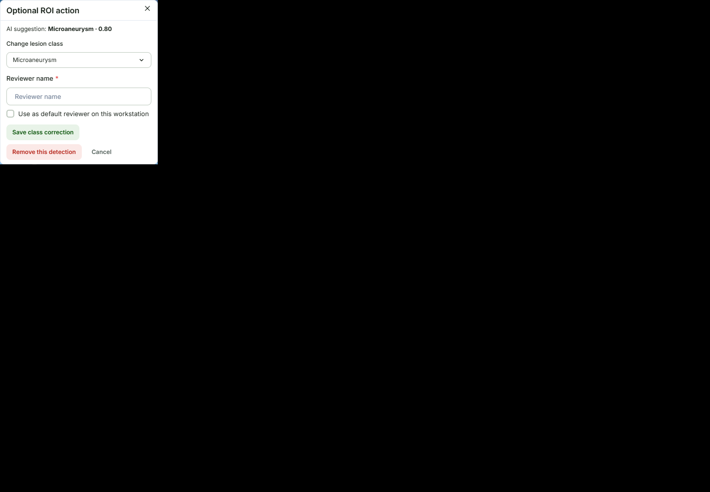

# Clinician decisions and annotations {#sec-annotations}

## Confirm DR Grade

**Purpose.** Record the clinician's final DR grade.

**Procedure.**

1. Open **Clinician Review**.
2. Review the optional **AI suggestion**.
3. Select a value from **Final DR grade**.
4. Check or edit **Reviewer name**.
5. Add a **Remark** when useful.
6. Choose **Confirm DR Grade**. Choose **Escalate** for an exception path.

**Expected result.** The human grade is saved as the authoritative clinician decision. A matching AI suggestion is recorded as `AI_ACCEPTED`, a different grade as `AI_CORRECTED`, and a grade without an AI result as `MANUAL`.

{#fig-grade fig-cap="Clinician Review records the final DR grade explicitly."}

## Edit Annotations

**Purpose.** Add or correct the active annotation set when the clinician identifies a change that needs to be recorded.

**Procedure.**

1. Choose **Edit annotations** from the case review surface.
2. Keep **AI suggestions** shown when comparing model evidence, or hide them to reduce visual density.
3. For a human annotation, select a tool, choose the canonical lesion class, and draw on the image.
4. Use the available selection and geometry controls for human annotations when needed.
5. Choose **Save draft** to persist work without confirming the set.
6. Choose **Confirm Annotation** after reviewing the active set.

**Expected result.** Human annotations remain separate from original AI evidence. A later edit invalidates the previous annotation confirmation until the current active set is confirmed again.

{#fig-editor fig-cap="Edit Annotations is the image-first surface for human annotation work."}

## Correct or remove one AI ROI

AI ROI editing is optional. Use it only when an obvious model class or detection needs correction.

1. In **Edit Annotations**, show **AI suggestions**.
2. Select the AI ROI on the image.
3. Read the original **AI suggestion**, including its original class and score.
4. Choose a different value under **Change lesion class**, then choose **Save class correction**, or choose **Remove this detection**.
5. Enter the actual **Reviewer name** used for the change.

The corrected overlay uses the reviewed class and indicates a clinician correction without assigning the AI score to that class. A removed detection is excluded from the active reviewed overlay while its original identity, geometry, score, model, and provenance remain available for audit.

{#fig-roi fig-cap="The optional ROI action shows the original AI suggestion before a class correction or removal."}

::: {.callout-warning title="WARNING - preserve score meaning"}
If the AI suggestion is `Hemorrhage - 0.90` and the clinician changes the reviewed class to `Microaneurysm`, the result is **Microaneurysm - Clinician corrected**. It must not be shown as `Microaneurysm - 0.90`.
:::

Geometry-level correction remains available through the existing optional CVAT workflow. This page does not replace CVAT with a second dense geometry editor.

## Default reviewer

**Purpose.** Reduce repeated typing on a shared review workstation.

1. Open **Settings**.
2. Enter a name in **Default reviewer**.
3. Clear or replace the value when the workstation user changes.

New or unattributed review forms are prefilled. The reviewer remains editable and can be cleared. Existing recorded reviewers are never rewritten by a later preference change. The preference is not stored in patient or image metadata and does not prove identity.

## Save and move between cases

Use **Previous** and **Next** to move between cases. Navigation does not save or confirm changes. In **Edit Annotations**, use **Save & Next Case** when the current draft should be saved before opening the next case.

If changes are unsaved, saving, or have failed, the application may show a navigation guard. Follow the prompt and retry **Save draft** when needed. **Next action** is guidance only; it does not change clinical state.
