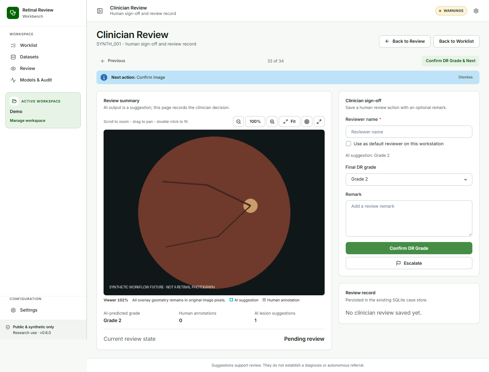
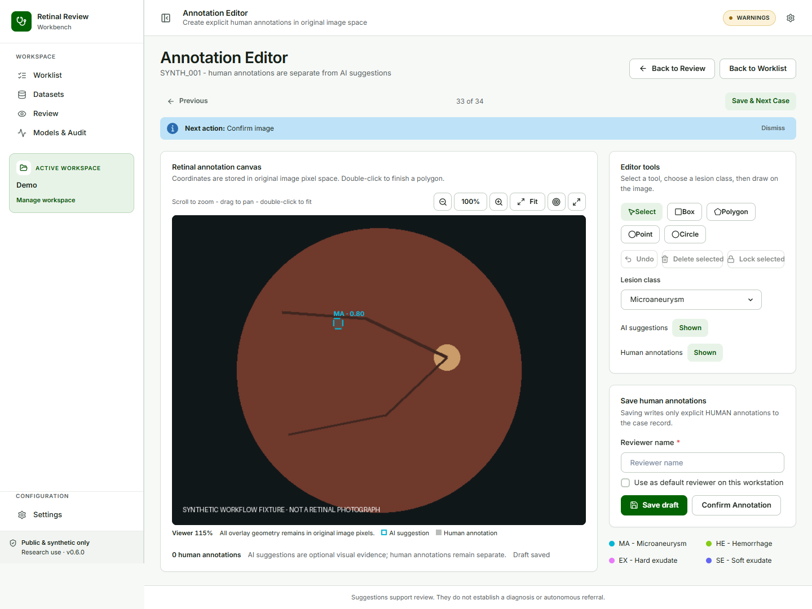
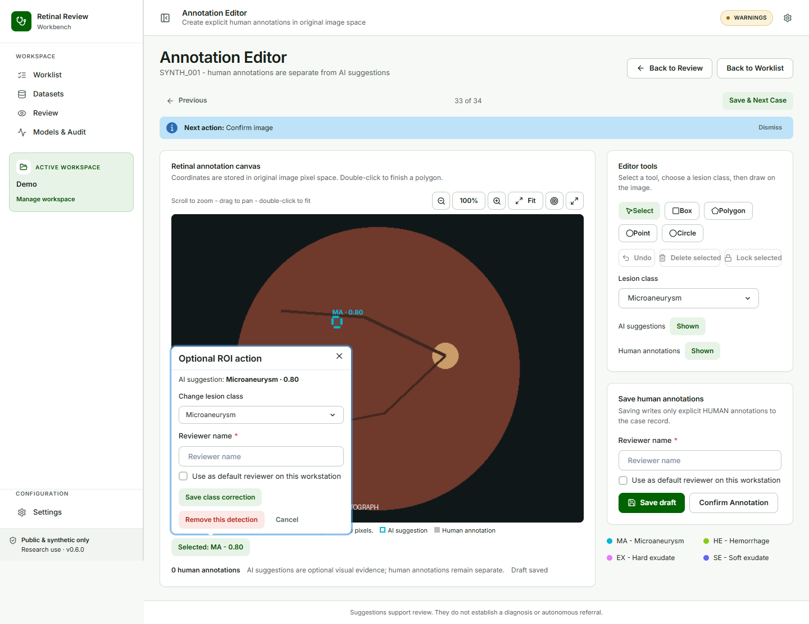

## Clinician review and annotations {#sec-annotations}

### Confirm DR Grade

#### Goal

Record the clinician's final DR grade without requiring a separate “accept” or “mark incorrect” workflow.

#### Before you start

Review the image and the optional RETFound suggestion. The final grade must be selected by the clinician.

#### Steps

1. Open **Clinician Review**.
2. Review **AI suggestion** when available.
3. Select a value from **Final DR grade**.
4. Check or edit **Reviewer name**.
5. Add an optional **Remark**.
6. Select **Confirm DR Grade**. Select **Escalate** for an exception path instead.

#### Expected result

The final grade is saved as `AI_ACCEPTED` when it matches the AI suggestion, `AI_CORRECTED` when it differs, or `MANUAL` when no AI grade was available. The human grade is authoritative.

#### What the system records

The system records grade, review source, reviewer, timestamp, revision, and review history. It does not silently accept a grade merely because the page was opened.

{#fig-confirm-grade fig-cap="Clinician Review records one explicit final grade decision."}

### Edit Annotations

#### Goal

Add or correct the active annotation set when the clinician notices an annotation that needs a human-authored change.

#### Before you start

Open **Edit annotations** from Review. Geometry editing is available for human annotations in original image pixel coordinates. Advanced dense correction may use the optional CVAT workflow.

#### Steps

1. Select **Edit annotations**.
2. Keep **AI suggestions** shown when comparing the model evidence, or hide them to reduce visual density.
3. Select an annotation tool and choose the canonical lesion class.
4. Draw, move, resize, lock, or delete a human annotation as needed.
5. Select **Save draft** to persist a non-final draft, or **Save & Next** to save the same draft and open the next case.
6. Select **Confirm Annotation** only after reviewing the current active set.

#### Expected result

Human annotations remain separate from original AI evidence. **Confirm Annotation** records the current active set hash, reviewer, and timestamp. Later edits invalidate that confirmation until the set is confirmed again.

#### What the system records

Human shape geometry, canonical class, reviewer, timestamp, revision, active annotation-set hash, and case-level finality are retained. Empty annotations may be confirmed as reviewed; they are not evidence that lesions are absent.

{#fig-editor fig-cap="Edit Annotations is the surface for human annotation work and finality."}

### Correct an AI ROI class

#### Goal

Correct an obvious model class without changing the original AI evidence.

#### Steps

1. In **Edit Annotations**, ensure **AI suggestions** are shown.
2. Select the AI ROI on the image.
3. Review **AI suggestion**, including its original class and score.
4. Choose a different value under **Change lesion class**.
5. Enter or confirm **Reviewer name** and optionally select **Use as default reviewer on this workstation**.
6. Select **Save class correction**.

#### Expected result

The overlay uses the reviewed class and indicates that it was clinician corrected. It does not display the original score as though it belonged to the corrected class. The detail remains available as `AI suggestion: Hemorrhage · 0.90`.

{#fig-roi-popover fig-cap="The optional ROI action is available in Edit Annotations, not in Review."}

### Remove an AI ROI

Select the ROI, review its original evidence, and choose **Remove this detection**. The detection is excluded from the active reviewed overlay and training annotation set, but its original detection identity, class, score, geometry, model, and provenance remain auditable.

::: {.callout-warning title="WARNING — score meaning"}
If AI predicted `Hemorrhage · 0.90` and the reviewer changes the class to `Microaneurysm`, do not describe the result as `Microaneurysm · 0.90`. The score belongs to the original AI suggestion only.
:::

### Reviewer preference and draft state

Use **Default reviewer** in **Settings** to set or clear the workstation value. New or unattributed forms prefill it; an existing recorded reviewer remains unchanged.

In Edit Annotations, the quiet status line reports **Saving draft**, **Draft saved**, **Unsaved changes**, or **Save failed — retry**. Autosave uses the existing annotation persistence path and never confirms the set. Leaving while changes are unsaved, in flight, or failed opens a guard.

### Previous, Next, and hints

Use **Previous** and **Next** on Review, Clinician Review, and Edit Annotations. Navigation does not save or confirm. **Next action** is guidance only and can be disabled from the hint close control or re-enabled in **Settings**.
