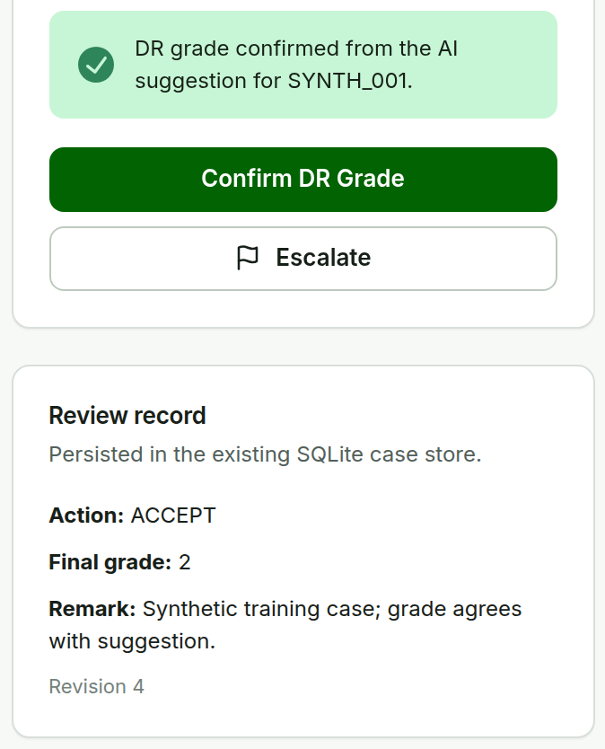

# Confirm DR Grade {#sec-grade}

**Purpose.** Record the clinician's final DR grade. This is the second confirmation milestone.

**Steps.**

1. From **Review**, choose **Clinician review**.
2. Check **Reviewer name**. It is prefilled when a workstation default is set.
3. Read the **AI suggestion** line, if a suggestion exists.
4. Select the **Final DR grade** (Grade 0--4).
5. Add a **Remark** when useful.
6. Choose **Confirm DR Grade**. Choose **Escalate** when the case needs a separate decision.

**Expected result.** A green confirmation appears and **Review record** shows the action, final grade, and remark. Keeping the model grade is recorded as `AI_ACCEPTED`, a different grade as `AI_CORRECTED`, and a grade without a model result as `MANUAL`. The human grade is the authoritative decision.

::: {layout-ncol=2 layout-valign="top"}
{#fig-grade}

{#fig-grade-recorded}
:::

**Confirm DR Grade & Next** at the top of the page saves the same decision and opens the next case.
