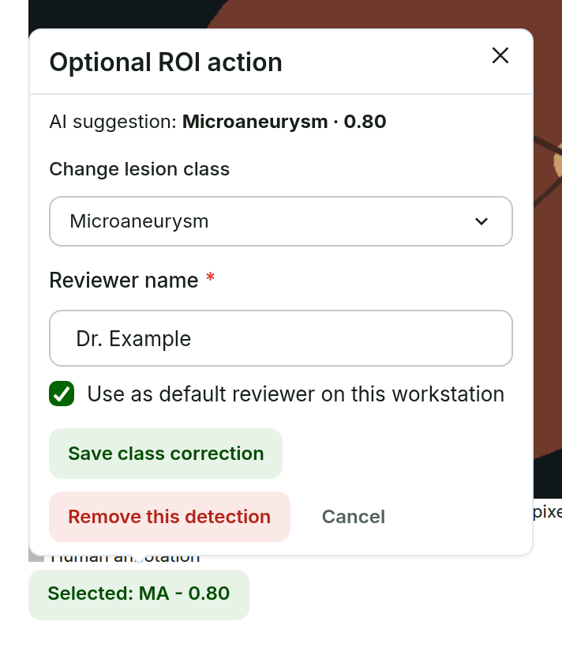
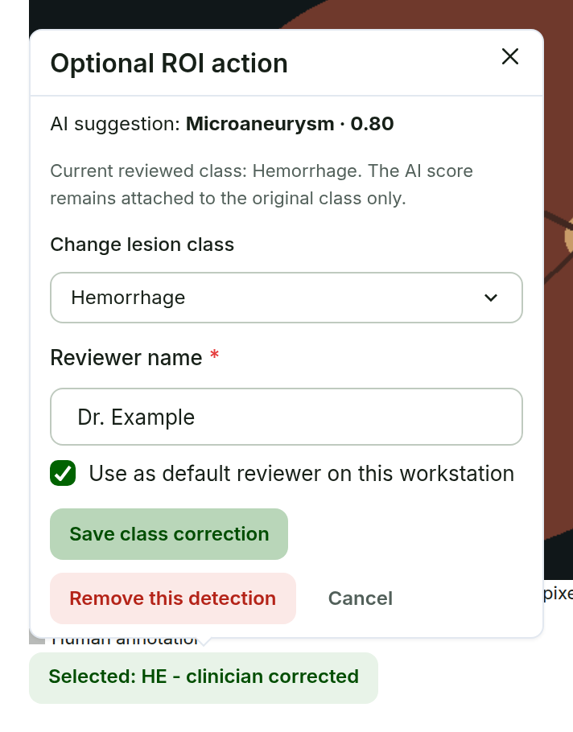

# Edit Annotations {#sec-annotations}

## Add human annotations

**Purpose.** Record human annotations, or change an AI ROI, only when the clinician identifies a change that should be recorded.

**Steps.**

1. From **Review** or **Clinician Review**, choose **Edit annotations**. The page opens as **Annotation Editor**.
2. Under **Editor tools**, choose **Box**, **Polygon**, **Point**, or **Circle**, then choose the **Lesion class**.
3. Draw on the image. Double-click to finish a polygon.
4. Use **Select**, **Undo**, **Delete selected**, and **Lock selected** to adjust your own annotations.
5. Keep **AI suggestions** shown when comparing with the model, or hide them to reduce clutter.

**Expected result.** Human annotations are stored in original image pixels and remain separate from the AI evidence. The draft is saved automatically (see @sec-autosave).

{#fig-editor width=76%}

## Correct or remove an AI ROI

**Purpose.** Fix an obvious model class, or remove a wrong detection. This is optional and is not a confirmation queue.

**Steps.**

1. In the Annotation Editor, keep **AI suggestions** shown and click the AI ROI on the image.
2. In **Optional ROI action**, read the original **AI suggestion** with its class and score.
3. To correct the class, choose a new value in **Change lesion class** and choose **Save class correction**.
4. To discard the detection, choose **Remove this detection**.
5. Check **Reviewer name** before saving.

**Expected result.** The corrected ROI shows the new class as **clinician corrected**, without a score. The original AI class, score, geometry, and provenance stay available for audit. A removed detection leaves the active overlay but remains in the audit record.

::: {.callout-important title="Important -- score meaning"}
A model score belongs to the class the model predicted. If PRISM suggests `Hemorrhage · 0.90` and you change the class to Microaneurysm, the result is **Microaneurysm -- clinician corrected**. It is never shown as `Microaneurysm · 0.90`.
:::

Dense geometry work can use the optional CVAT round trip (@sec-cvat). The Annotation Editor does not replace it.

::: {layout="[[40,-4,40]]" layout-valign="top"}
{#fig-roi}

{#fig-roi-corrected}
:::
