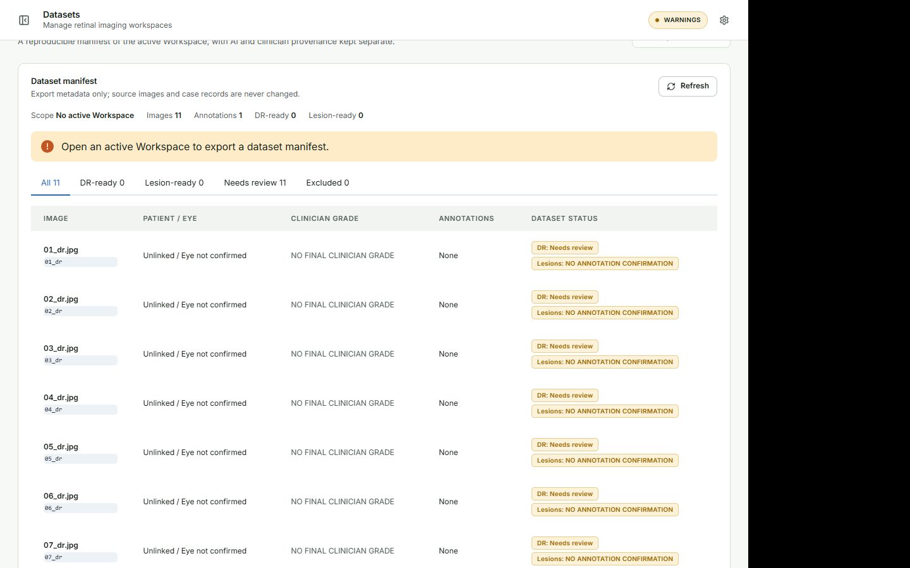
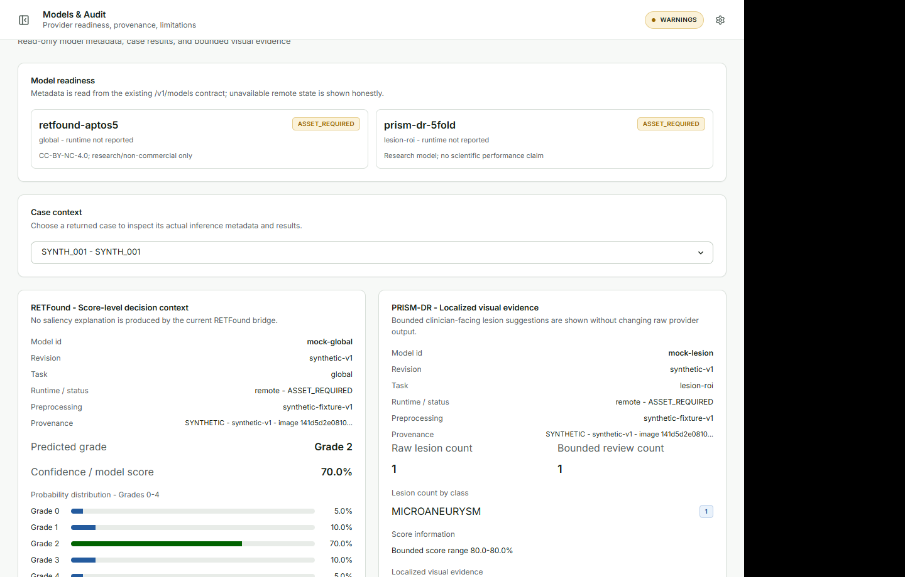

# Datasets and audit {#sec-datasets}

## Check readiness

**Purpose.** Check task-specific readiness without mixing DR-grade and lesion-annotation rules.

1. Open **Datasets**.
2. Choose **All**, **DR-ready**, **Lesion-ready**, **Needs review**, or **Excluded**.
3. Read the separate DR and lesion status in each case row.
4. Correct the case in **Clinician Review** or **Edit Annotations** when the status requires it.

**Expected result.** Classification and lesion readiness remain separate. A final grade can make a case DR-ready without annotation confirmation. A confirmed annotation set can make a case Lesion-ready without a final DR grade, subject to the existing dataset rules.

{#fig-datasets fig-cap="Datasets presents task-specific readiness and a compact representative case list."}

## Export the manifest

1. Open an active Workspace.
2. Verify the current case state and readiness.
3. Choose **Export manifest**.
4. Confirm the success message and output location shown by the application.

The export package contains `manifest.json`, `images.csv`, and `annotations.csv`. The package uses schema `s4.dataset-manifest.v2` and keeps source identity, coordinate space, confirmation state, task readiness, and annotation provenance.

AI-only evidence is not silently promoted to ground truth. Untouched AI, case-level confirmation, human correction, human-authored, removed, and CVAT-imported states remain distinguishable through the export fields.

## Read-only audit

Use **Models & Audit** to inspect:

- RETFound and PRISM-DR model IDs, revisions, runtime state, and limitations;
- inference metadata and lesion counts by class;
- source SHA-256 and analysis or derivative SHA-256 values;
- original AI evidence and annotation correction/removal provenance.

{#fig-audit fig-cap="Models & Audit exposes technical lineage without creating another clinician task list."}

## Optional CVAT

Use the configured CVAT Online integration for dense annotation or geometry correction. The existing round trip preserves source and prediction hashes and remains optional. CVAT Online is not part of the offline workstation requirement.
