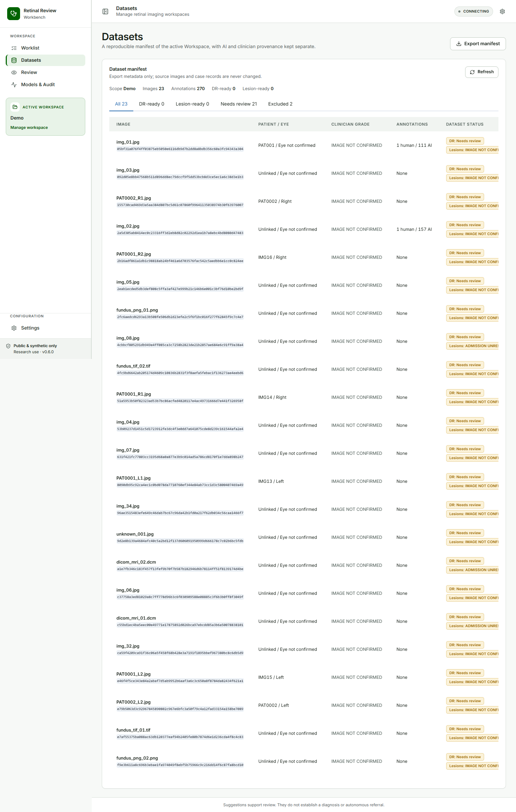
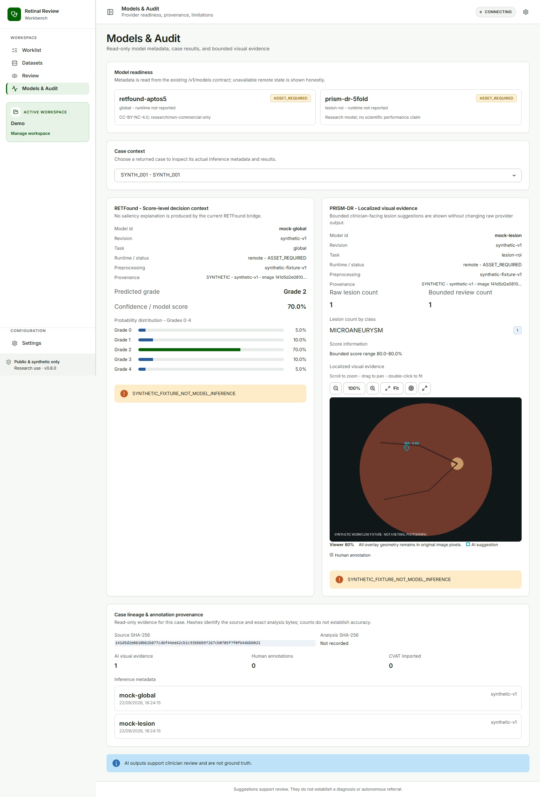

## Dataset and audit surfaces {#sec-datasets}

### Dataset readiness

#### Goal

Determine whether a case is ready for DR-grade work, lesion work, both, neither, or exclusion.

#### Steps

1. Open **Datasets**.
2. Select **DR-ready**, **Lesion-ready**, **Needs review**, or **Excluded**.
3. Read the task-specific status in the case row.
4. Open **Models & Audit** when technical lineage or model provenance needs inspection.

#### Expected result

Classification and lesion readiness are shown separately. A final grade can make a case DR-ready without annotation confirmation. A confirmed annotation set can make a case Lesion-ready without a final DR grade.

{#fig-datasets fig-cap="Datasets separates DR-ready and Lesion-ready status."}

### Export the manifest

#### Before you start

Open an active Workspace and verify that the current case state and readiness are correct.

#### Steps

1. Select **Export manifest**.
2. Confirm the success message and output directory shown by the application.
3. Give the package to the approved dataset operator for downstream handling.

#### Expected result

The output contains `manifest.json`, `images.csv`, and `annotations.csv`. The manifest schema is `s4.dataset-manifest.v2` and records file hashes, source hashes, coordinate system, canonical taxonomy, confirmation states, task readiness, and provenance.

#### What the system records

Untouched AI, corrected AI, removed AI, human, and CVAT-imported annotations remain distinguishable. The export does not silently promote AI pseudo-labels to ground truth.

### Models & Audit

Use this read-only surface to inspect:

- RETFound and PRISM-DR model identifiers, revisions, runtime status, and warnings;
- grade and lesion inference metadata and counts by class;
- source SHA-256 and analysis/derivative SHA-256 values;
- annotation source, correction/removal provenance, and finality state.

{#fig-models-audit fig-cap="Models & Audit exposes technical lineage without creating another review queue."}

### Optional CVAT

Use the configured CVAT Online integration only for dense annotation or geometry correction. The round trip preserves source and prediction hashes, validates the configured project and labels, and is idempotent for a known task. CVAT is optional and excluded from offline acceptance.
