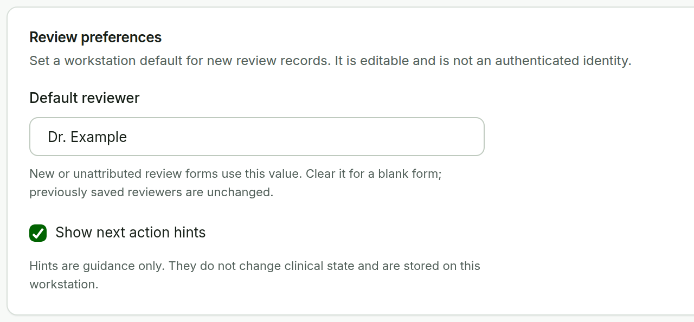
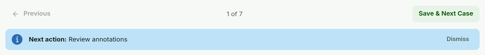
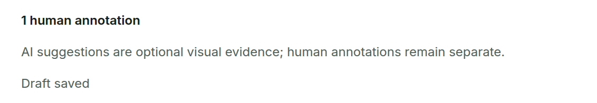

# Working Through Cases {#sec-repeated}

These conveniences reduce repetitive work. None of them confirms a milestone or changes clinical state on its own.

## Reviewer default {#sec-reviewer-default}

Select **Use as default reviewer on this workstation** in any reviewer field, or set **Default reviewer** in **Settings**, to prefill new or unattributed review forms.

{#fig-reviewer width=66%}

The value is stored only in this browser. It stays editable, it is not authentication, and it never rewrites reviewer names already recorded. On a shared workstation, change or clear it when the user changes.

## Previous / Next and Save & Next

**Previous** and **Next** move through the case order shown in the middle (for example `1 of 7`). Moving does not save or confirm anything. In the Annotation Editor, **Save & Next Case** saves the current draft and opens the next case; in Clinician Review, **Confirm DR Grade & Next** confirms the grade first.

{#fig-navigation width=100%}

## Autosave and unsaved changes {#sec-autosave}

In the Annotation Editor, edits are saved as a draft about one second after you stop editing, provided a reviewer name is entered. The status below the canvas shows **Unsaved changes**, **Saving draft...**, **Draft saved**, or **Save failed --- retry**. **Save draft** saves immediately.

{#fig-draft width=68%}

A draft is not a confirmation. If you try to leave while changes are unsaved, saving, or failed, the workstation asks *You have unsaved annotation changes. Leave this case?* Choose **Cancel** to stay and save.

## Next action hint

The blue **Next action** line suggests the next step, for example **Confirm image**, **Confirm DR grade**, **Review annotations**, or **Complete**. It is guidance only. Choose **Dismiss** to hide hints on this workstation; turn them back on with **Show next action hints** in **Settings**.

```{=latex}
\Needspace{30\baselineskip}
```
