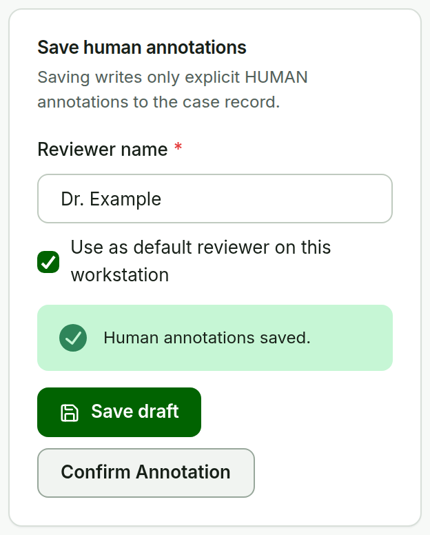

# Confirm Annotation {#sec-confirm-annotation}

**Purpose.** Confirm that the current active annotation set has been reviewed. This is the third confirmation milestone.

::::: {layout="[56,44]" layout-valign="top"}
:::: {}
**Steps.**

1. Finish any human annotations or AI ROI changes.
2. Check **Reviewer name** in **Save human annotations**.
3. Choose **Confirm Annotation**.

**Expected result.** The draft is saved, then the reviewer, timestamp, and a hash of the active set are recorded. The **Next action** hint changes to **Complete** when the grade is also confirmed.

::::
:::: {}
{#fig-confirm-annotation width=100%}
::::
:::::

**Later edits.** Any later edit changes the hash, so the case needs **Confirm Annotation** again before it is Lesion-ready. Confirming an empty set is allowed; it records that the set was reviewed, not that lesions are absent.
