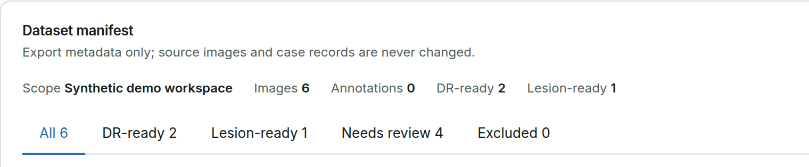
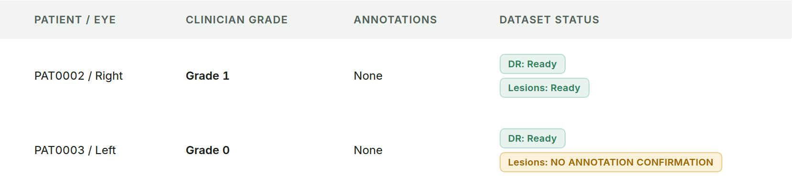
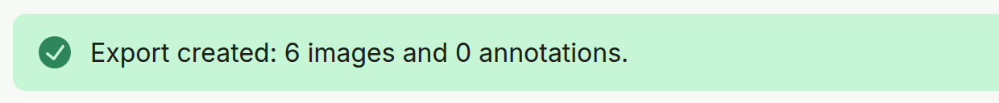

# Dataset Readiness and Export {#sec-datasets}

## Check readiness

**Purpose.** See which cases are ready for each task. Classification readiness and lesion readiness are separate states.

**Steps.**

1. Open **Datasets**. The summary line shows **Images**, **Annotations**, **DR-ready**, and **Lesion-ready** for the active Workspace.
2. Choose a tab: **All**, **DR-ready**, **Lesion-ready**, **Needs review**, or **Excluded**.
3. Read the two status chips in **Dataset status**: one for DR, one for lesions.
4. Fix a case in **Clinician Review** or **Edit annotations** when its status asks for it.

{#fig-dataset-summary width=70%}

{#fig-dataset-readiness width=80%}

**Expected result.**

- **DR-ready** needs valid source provenance, an included fundus image, and a final clinician grade with reviewer and timestamp.
- **Lesion-ready** needs valid source provenance, an included fundus image, and a current **Confirm Annotation** whose hash matches the active set.

One task can be ready while the other is not. AI-only evidence is never promoted to ground truth by itself.

## Export the manifest

**Steps.**

1. Check the readiness of the active Workspace.
2. Choose **Export manifest**.
3. Read the confirmation message.

{#fig-export width=62%}

**Expected result.** The package is written to the Workspace output folder: `manifest.json`, `images.csv`, and `annotations.csv` (schema `s4.dataset-manifest.v2`). Source images and case records are not changed. Untouched AI, human-authored, corrected, removed, and CVAT-imported states remain distinguishable in the export.
