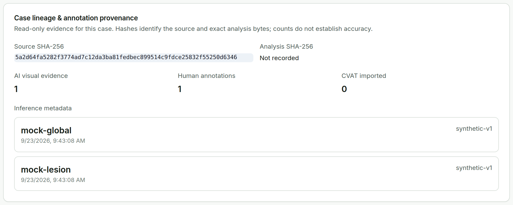

# Models & Audit and Traceability {#sec-audit}

## Models & Audit

Open **Models & Audit** when technical inspection is needed. It is read-only and is not another review queue. For the selected case it shows:

- model readiness, model IDs, revisions, runtime state, and limitations;
- the RETFound score context and the PRISM-DR lesion counts by class;
- **Case lineage & annotation provenance**: source SHA-256, analysis SHA-256, AI visual evidence, human annotations, CVAT imports, and inference metadata.

{#fig-audit width=90%}

## What the workstation records

For every case the workstation keeps:

| Record | Contents |
|:-------|:---------|
| Source identity | Original filename, source SHA-256, admission state; the source file is never modified. |
| Case context | Pseudonymous patient key, eye, reviewer, and timestamp from **Confirm Image**. |
| Model evidence | Model ID, revision, preprocessing, analysis SHA-256, grade suggestion, raw lesion output. |
| Clinician decisions | Final DR grade, review action (`AI_ACCEPTED`, `AI_CORRECTED`, `MANUAL`), remark, reviewer, time. |
| Annotations | Human annotations, AI ROI corrections and removals with the original AI evidence, and the confirmation hash. |
| Dataset state | DR-ready and Lesion-ready status and the exported manifest. |

: {tbl-colwidths="[24,76]"}

## Optional CVAT {#sec-cvat}

CVAT Online can be used for dense annotation or geometry correction when your operator has configured it. The round trip preserves source and prediction hashes. CVAT is optional and is not needed for offline review or export; the local workstation remains the source of the final case state.

```{=latex}
\Needspace{30\baselineskip}
```
