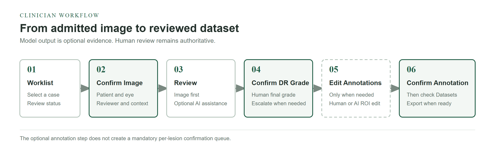

## Document control

| Field | Value |
| --- | --- |
| Document title | Retinal Review Workbench - Clinician User Manual |
| Document ID | RRW-CLIN-UM-001 |
| Software version | 0.7.0 |
| Manual version | 1.0 |
| Status | Controlled release documentation |
| Date | 2026-09-23 |
| Owner | Retinal Review Workbench maintainers |

**Revision history**

| Version | Date | Change |
| --- | --- | --- |
| 1.0 | 2026-09-23 | Rebuilt as a concise Quarto manual for the current clinician workflow. |

## Quick start

Use this sequence for an ordinary supported retinal image:

1. In **Worklist**, select the case and choose **Confirm Image**.
2. In **Review**, inspect the retinal image. Choose **Analyze** only when optional model assistance is useful.
3. Use **Show AI suggestions** and the lesion filter to inspect PRISM overlays. No individual ROI confirmation is required.
4. In **Clinician Review**, select the final grade and choose **Confirm DR Grade**.
5. Open **Edit Annotations** only when a correction or human annotation is needed. Choose **Confirm Annotation** after reviewing the active set.
6. In **Datasets**, check **DR-ready** and **Lesion-ready** separately before export.

{#fig-workflow fig-cap="The clinician workflow has three case-level confirmation milestones. Optional model evidence and ROI edits do not create a mandatory per-lesion queue."}

::: {.callout-important title="IMPORTANT - three confirmation milestones"}
**Confirm Image**, **Confirm DR Grade**, and **Confirm Annotation** record separate case-level milestones. AI suggestions are optional assistance. They do not have to be confirmed or rejected one by one before the clinical review can be completed.
:::
