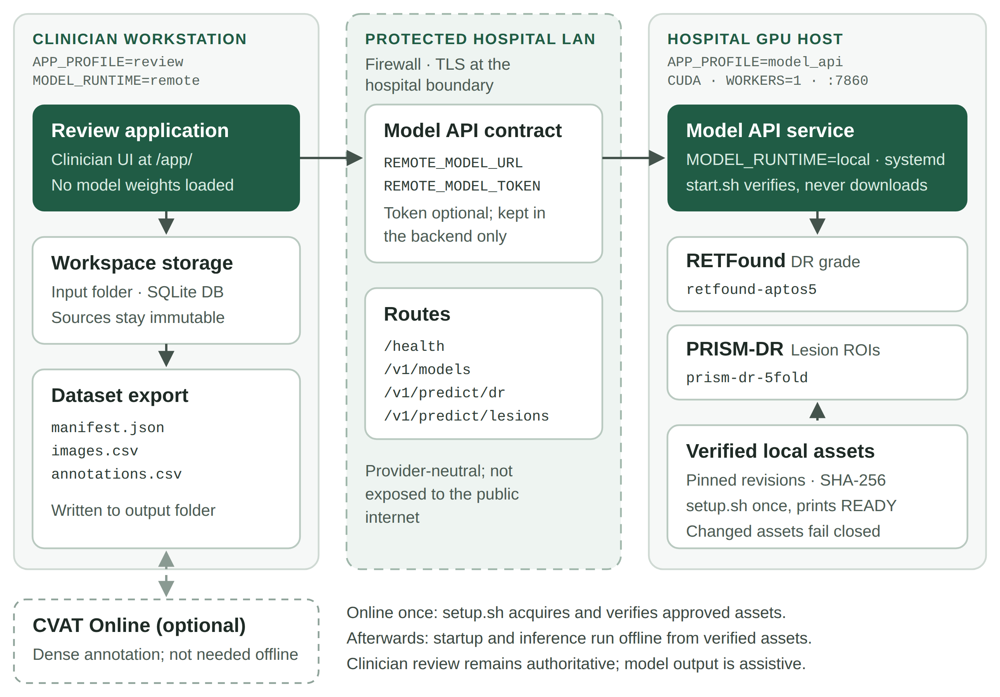

# Architecture and Supported Scope {#sec-architecture}

## Topology

The deployment has three parts: the clinician workstation, the protected hospital LAN, and the hospital GPU host (@fig-architecture).

| Component | Role |
|:----------|:-----|
| Review workstation | React/Vite clinician UI and FastAPI review routes at `/app/`; Workspace catalog, local review state, annotations, and export. |
| Model API | FastAPI service on a GPU host with `APP_PROFILE=model_api` and `MODEL_RUNTIME=local`. |
| RETFound | Five-class DR grade suggestion through `retfound-aptos5`. |
| PRISM-DR | Optional lesion ROI suggestions through `prism-dr-5fold`. |
| CVAT Online | Optional dense annotation and geometry correction. Not part of offline acceptance. |

: {tbl-colwidths="[24,76]"}

{#fig-architecture width=94%}

## Boundaries

The review profile does not load model weights. It calls the provider-neutral Model API. The Model API supports the existing fundus image contracts only. MRI, OCT, PACS, DICOMweb, calibration, XAI/Grad-CAM, and autonomous diagnosis are outside this release.

The application keeps the `/ui` static surface for compatibility with existing local integrations. Normal users and deployments use `/app/`; `/ui` is legacy compatibility only.

## Data ownership

The review workstation owns Workspace configuration, case state, annotations, audit events, and export files. The Model API is stateless for clinical records and returns model metadata, inference results, and provenance. Original admitted source images remain immutable.
