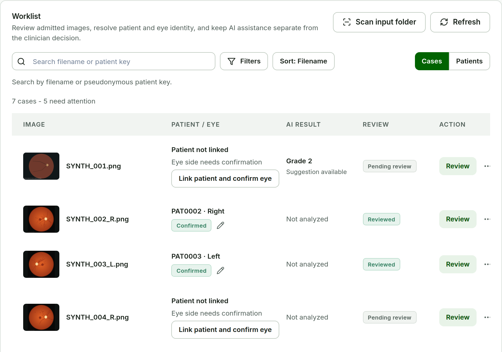
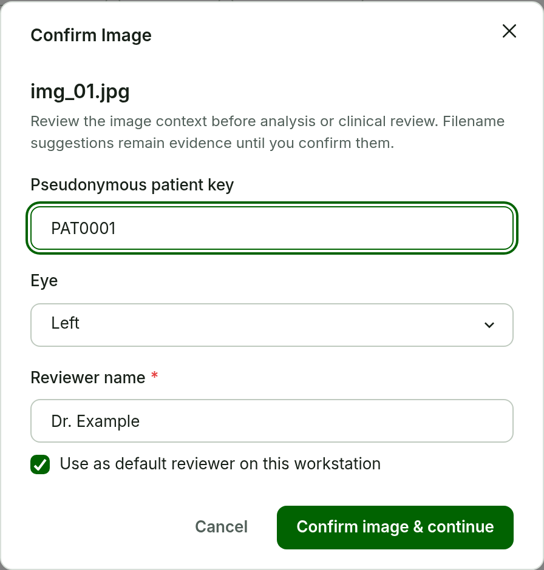

# Worklist and Confirm Image {#sec-worklist}

## Open the Worklist

**Purpose.** Start a review session in the approved Workspace.

**Steps.**

1. Start the workstation with the launcher provided by your operator and open `http://127.0.0.1:8000/app/`.
2. Check that the sidebar shows the correct **Active workspace**. If not, open **Settings** and select it.
3. In **Worklist**, choose **Scan input folder** when new images have been added.

**Expected result.** Each admitted image appears as one row with its patient and eye context, AI result, review status, and actions. Source files are never moved or changed.

{#fig-worklist width=100%}

```{=latex}
\Needspace{32\baselineskip}
```

## Confirm Image

**Purpose.** Confirm the image context before analysis or clinical review. This is the first confirmation milestone.

::::: {layout="[58,42]" layout-valign="top"}
:::: {}
**Steps.**

1. In the case row, choose **Confirm Image**. (After the first confirmation the row shows **Review**; **Confirm Image again** stays in the row menu **...**.)
2. Check the filename and the note above the fields.
3. Enter the **Pseudonymous patient key**, for example `PAT0001`. Leave it empty when the case should stay unlinked.
4. Set **Eye** to **Left**, **Right**, or **Unknown**.
5. Set **Image type** to **Conventional fundus photograph**, **Ultra-widefield**, or **Not sure yet**. If uncertain, leave **Not sure yet**; the clinician can still review the image, but AI analysis stays unavailable.
6. Enter your **Reviewer name**. Select **Use as default reviewer on this workstation** to prefill it next time.
7. Choose **Confirm image & continue**.

**Expected result.** The patient and eye context, reviewer, and timestamp are saved and **Review** opens for this image.
::::
:::: {}
{#fig-confirm-image width=100%}
::::
:::::

Filename or resolver suggestions are evidence only; nothing is inferred from a filename until you confirm it.

## Admission exceptions

Use the row status to decide the next action. **Resolve image readiness** and **Exclude from queue** are available in the same row menu. A recognized MRI or other non-fundus DICOM stays **Unsupported modality** and is never sent to RETFound or PRISM-DR.

::: {.callout-important title="Important -- source files"}
Do not rename, move, overwrite, or recompress admitted source images. The workstation records the original source identity and works from it.
:::

```{=latex}
\Needspace{40\baselineskip}
```
