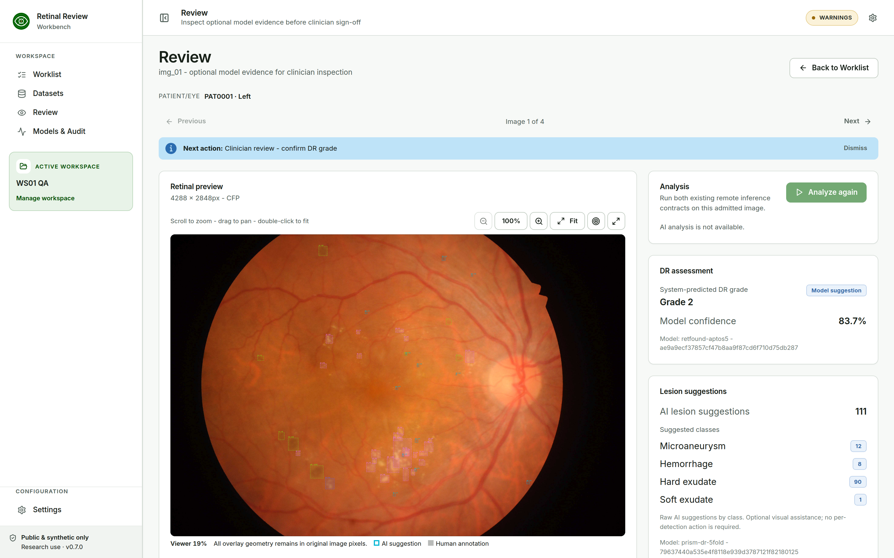
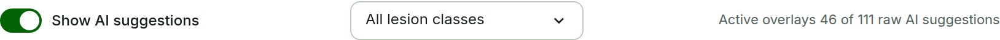

# Review and Optional AI Assistance {#sec-review}

## Inspect the image

**Purpose.** Inspect the retinal image and any optional model evidence before the grade decision. No clinical decision is recorded on this page.

{#fig-review width=90%}

**Steps.**

1. Review opens after **Confirm Image**. You can also open it with **Review** in a confirmed Worklist row.
2. Use the viewer controls to zoom, fit, pan, inspect coordinates, or open the full-screen view.
3. Check the **Patient/Eye** line above the image.
4. Choose **Analyze** only when model assistance is wanted and the Model API is available. If it is not available, continue with manual review.
5. Choose **Continue to clinician review**. This is the only forward action on Review.

**Expected result.** The retinal image stays the main surface. The right column shows **Analysis**, **DR assessment**, and **Lesion suggestions**. Annotation work is not started from Review; it follows the grade decision (@sec-annotations).

## Read the model suggestions

- **DR assessment** shows the RETFound grade suggestion and its model confidence. This is a model score, not a calibrated probability.
- **Lesion suggestions** counts PRISM-DR suggestions by class. An untouched overlay is labelled with class and score, for example `EX · 0.82`.
- The lesion summary is not a task list. You do not need to inspect every AI ROI.

## Show or filter the overlays

Use **Show AI suggestions** to show or hide the PRISM overlays, and the lesion filter to display **All lesion classes** or one class: **MA · Microaneurysm**, **HE · Hemorrhage**, **EX · Hard exudate**, or **SE · Soft exudate**. The counter shows how many raw AI suggestions are active.

{#fig-ai-controls width=80%}
