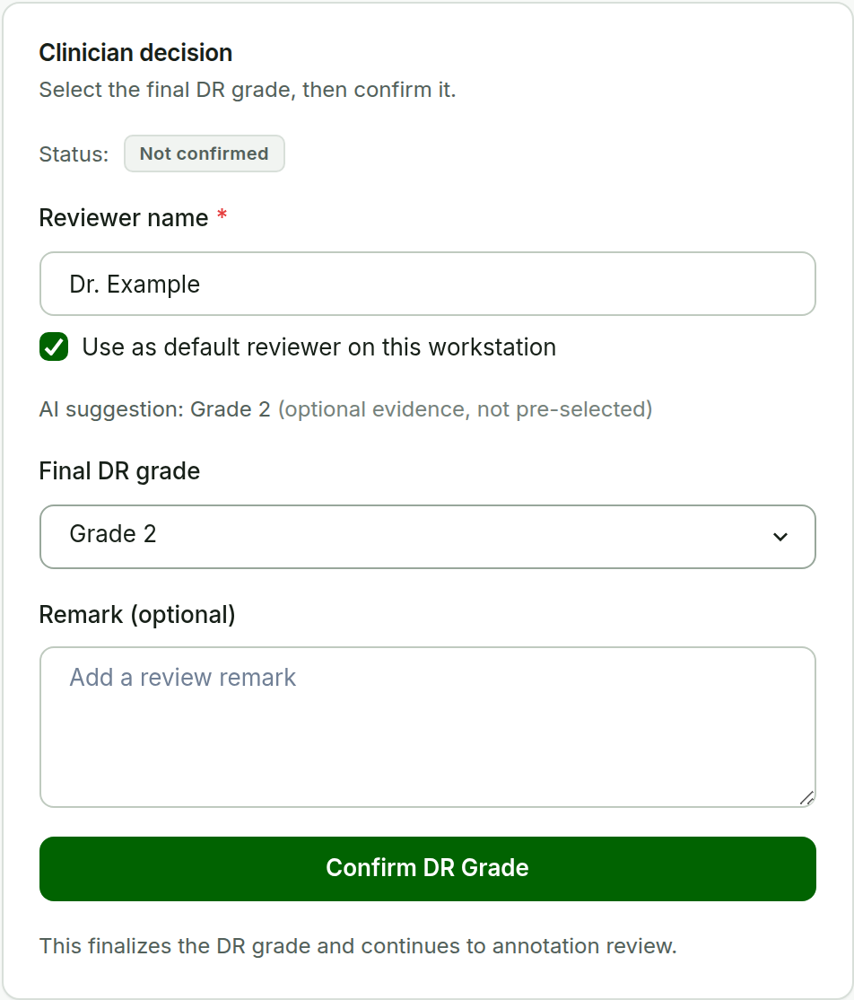
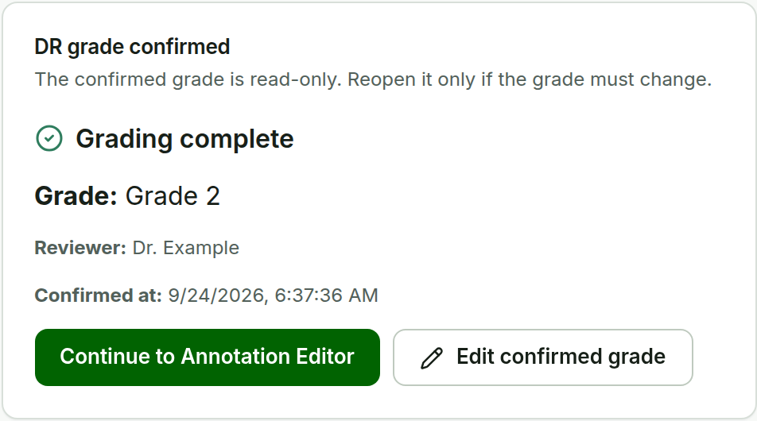
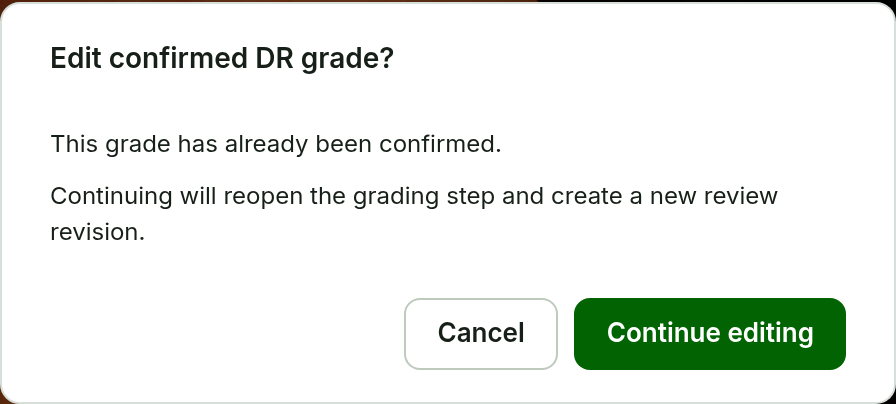

# Confirm DR Grade {#sec-grade}

**Purpose.** Record the clinician's final DR grade. This is the second confirmation milestone.

**Steps.**

1. From **Review**, choose **Continue to clinician review**.
2. Check **Status: Not confirmed** and **Reviewer name**. The reviewer is prefilled when a workstation default is set.
3. Read the **AI suggestion** line, if a suggestion exists. It is never pre-selected.
4. Select the **Final DR grade** (Grade 0--4). **Confirm DR Grade** stays disabled until a grade is selected.
5. Add a **Remark (optional)** when useful.
6. Choose **Confirm DR Grade**.

**Expected result.** *DR grade confirmed · Grading complete* appears and the **Annotation Editor** opens for the same image, showing *DR grade confirmed · Grade X*. Keeping the model grade is recorded as `AI_ACCEPTED`, a different grade as `AI_CORRECTED`, and a grade without a model result as `MANUAL`. The human grade is the authoritative decision.

If you are not ready to decide, do not press **Confirm DR Grade**; the grade simply stays *Not confirmed*. There is no separate senior-review or not-confirm action. Historical senior-review records from earlier versions remain readable and are labelled *Legacy senior-review record*.

::: {layout="[52,48]" layout-valign="top"}
{#fig-grade}

{#fig-grade-recorded}
:::

## Change a confirmed grade

Returning to a confirmed case shows **DR grade confirmed** with the grade, reviewer, and confirmation time. To change it, choose **Edit confirmed grade**. One warning appears for this edit session:

{#fig-edit-grade width=52%}

Choose **Continue editing** to reopen the grade. The new confirmation creates a new review revision; the earlier decision stays in the review history.
