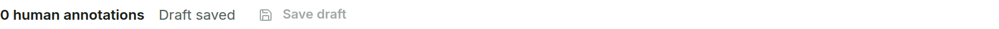

# Working Through Cases {#sec-repeated}

These conveniences reduce repetitive work. None of them confirms a milestone or changes clinical state on its own.

## Reviewer default {#sec-reviewer-default}

Select **Use as default reviewer on this workstation** in any reviewer field, or set **Default reviewer** in **Settings**, to prefill new or unattributed review forms.

{#fig-reviewer width=66%}

The value is stored only in this browser. It stays editable, it is not authentication, and it never rewrites reviewer names already recorded. On a shared workstation, change or clear it when the user changes.

## Previous and Next

**Previous** and **Next** move through the Worklist order shown in the middle (for example `Image 1 of 4`) and open the other image at Review. Moving never saves a confirmation. While the current image is not complete, or has unsaved edits, one warning appears for that switch:

{#fig-navigation width=52%}

Choose **Stay on this image** to continue, or **Switch image** to open the other image; the autosaved draft is kept. **Back to Worklist** on Clinician Review and Annotation Editor asks the same question. A complete image switches without a warning.

## Autosave {#sec-autosave}

In the Annotation Editor, edits are saved in the background about one second after you stop editing, provided a reviewer name is entered. The status below the canvas shows **Saving...**, **Draft saved**, or **Save failed**. The small **Save draft** button saves immediately if you need it.

{#fig-draft width=68%}

A draft is not a confirmation; only **Confirm Annotation** completes the image.

## Next action hint

The blue **Next action** line suggests the next step, for example **Confirm image**, **Clinician review - confirm DR grade**, **Confirm annotation**, or **Review complete**. It is guidance only. Choose **Dismiss** to hide hints on this workstation; turn them back on with **Show next action hints** in **Settings**.

```{=latex}
\Needspace{30\baselineskip}
```
