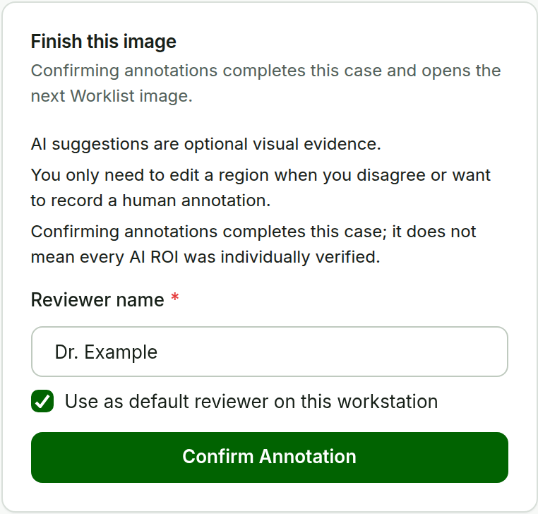
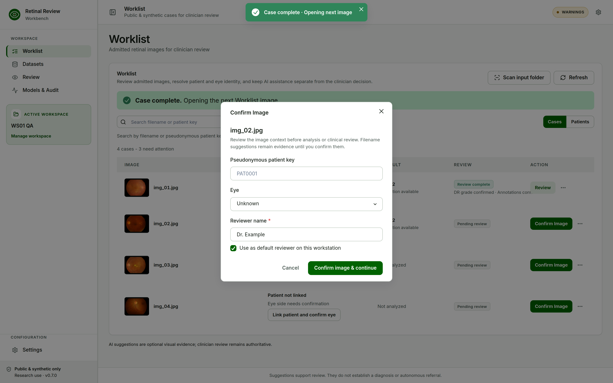
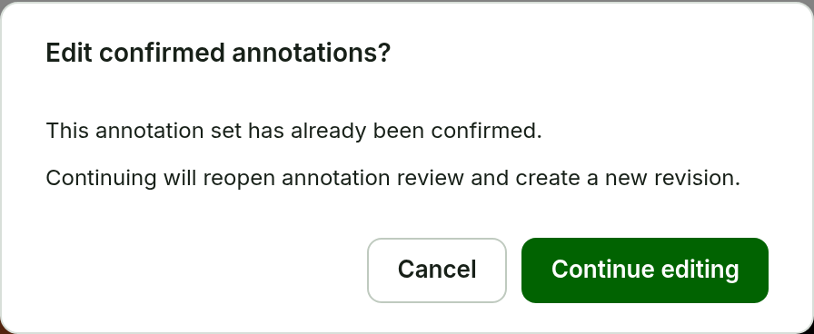

# Confirm Annotation {#sec-confirm-annotation}

**Purpose.** Finish this image. This is the third confirmation milestone.

::::: {layout="[50,50]" layout-valign="top"}
:::: {}
**Steps.**

1. Make any optional ROI changes. You do not need to inspect every AI ROI.
2. Check **Reviewer name** in **Finish this image**.
3. Choose **Confirm Annotation**.

**Expected result.** Any pending draft is saved, then the reviewer, timestamp, and a hash of the active annotation set are recorded. *Case complete · Opening next image* appears, the Worklist shows **Review complete** for this image, and **Confirm Image** opens for the next unfinished Worklist image. When every image is complete, the Worklist says so.
::::
:::: {}
{#fig-confirm-annotation width=100%}
::::
:::::

{#fig-case-complete width=90%}

## Change confirmed annotations

A confirmed image shows **Annotations confirmed** with the reviewer and time, and the editor is read-only. Choose **Edit confirmed annotations** (or click an AI ROI) to reopen it; one warning appears per edit session. Any later edit changes the hash, so the image needs **Confirm Annotation** again before it is Lesion-ready.

{#fig-edit-annotations width=52%}

Confirming an empty set is allowed; it records that the set was reviewed, not that lesions are absent.
