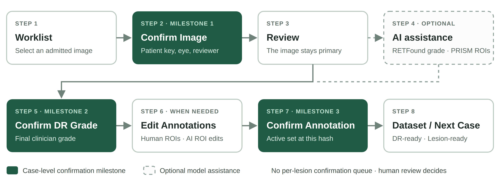

<!-- canonical-topic: clinician-workflow -->

# Quick Start {#sec-quick-start}

Retinal Review Workbench takes one admitted retinal image through a controlled review and turns the clinician's decisions into a traceable dataset record. Use this page as the everyday checklist; the following chapters explain each step.

{#fig-workflow width=100%}

1. **Worklist** -- select the case. Open the row menu (**...**) and choose **Confirm Image**.
2. **Confirm Image** -- check the pseudonymous patient key, the eye, and your reviewer name, then choose **Confirm Image**.
3. **Review** -- inspect the retinal image. Choose **Analyze** only when optional model assistance is useful and available.
4. **Optional AI** -- read the RETFound grade suggestion and toggle the PRISM lesion overlays with **Show AI suggestions**.
5. **Clinician Review** -- select the **Final DR grade** and choose **Confirm DR Grade**.
6. **Annotation Editor** -- only when a human annotation, or a correction or removal of an AI ROI, is needed.
7. **Confirm Annotation** -- confirm the active annotation set after reviewing it.
8. **Datasets** -- check **DR-ready** and **Lesion-ready** separately, then export or move to the next case.

::: {.callout-important title="Important -- three confirmations"}
**Confirm Image**, **Confirm DR Grade**, and **Confirm Annotation** are the only case-level confirmations. AI suggestions never need to be accepted or rejected one by one before the review can be completed.
:::
